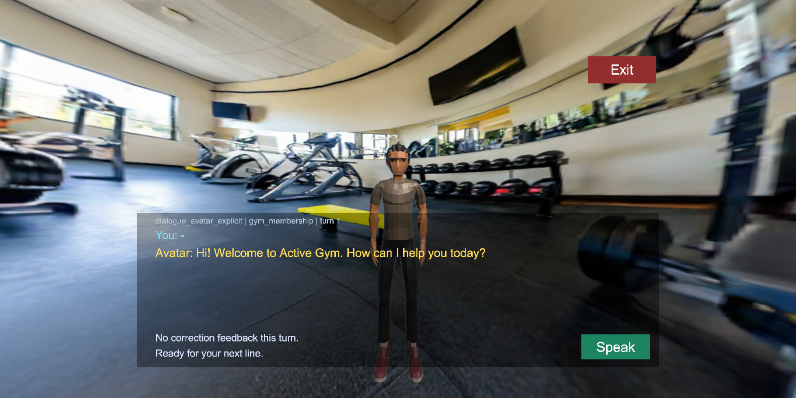
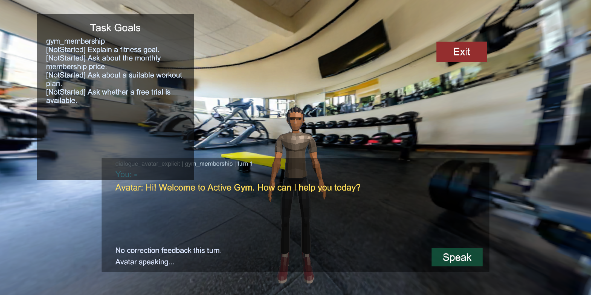
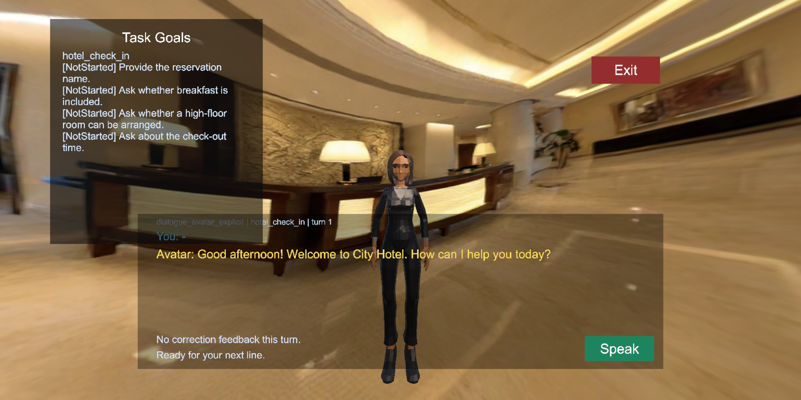

# Experiment v1.1 Developer Goal Panel Fix Report

## Baseline

- Branch: `experiment-v1.1-integration`
- Starting HEAD: `cc3e2e9a535384cd38123a36e461981aab470daa`
- Starting remote HEAD: `origin/experiment-v1.1-integration` = `cc3e2e9a535384cd38123a36e461981aab470daa`
- Unity: `6000.3.16f1`
- Active scene: `Assets/Scenes/SampleScene.unity`
- Active build target: Android

The locally installed Unity Skills package files remain outside this fix. In particular, `Client/Packages/manifest.json`, `Client/Packages/packages-lock.json`, and `Client/.agents/skills/` are not part of the commit.

## Reproduction and root cause

The failure was reproduced through the normal runtime UGUI path:

`Main Menu -> Start -> Gym Membership`

Before the fix, the scene, fixed panorama, avatar, opening question, and dialogue panel loaded, but the runtime object `SceneTalkVR Demo Rig/SceneTalkVR World UI/SceneTalkVR Flow UI/ReadOnlyTaskGoalPanel` had `activeSelf=false`. Its `GoalStateText` was empty. The `ExperimentLifecycleCoordinator` had no assignment, no current condition, no `conditionRunId`, no `questionnaireLinkageKey`, and an empty `GoalProgressTracker`. The Console contained no error.

The direct cause was not a missing object or a Canvas sorting failure. `SceneTalkFlowUiController.BuildTaskButtons` ultimately called `SceneTalkOrchestrator.LoadAssignedTask(taskId)`. The old fixed-task startup path called `ExperimentConditionManager.LoadAssignedTask` directly and never entered `ExperimentLifecycleCoordinator.PrepareCondition`. Consequently, the normal Developer task-selection path bypassed lifecycle reset, assignment identity creation, goal initialization, and the data consumed by `RefreshGoalPanel`.

The panel also used an off-canvas horizontal offset (`x=-610`) that clipped most of the panel when it was forced visible. This was a secondary layout defect, not the cause of the empty tracker.

## Old and new call chains

Old:

```text
BuildTaskButtons callback
  -> SceneTalkOrchestrator.LoadAssignedTask(taskId)
  -> RunFixedTaskStartup(taskId)
  -> ExperimentConditionManager.LoadAssignedTask(taskId)
  -> fixed panorama/avatar/dialogue startup

ExperimentLifecycleCoordinator: bypassed
GoalProgressTracker.ResetGoals: not called
ReadOnlyTaskGoalPanel: inactive because tracker.Goals.Count == 0
```

New:

```text
BuildTaskButtons callback
  -> SceneTalkOrchestrator.LoadAssignedTask(taskId)
  -> RunFixedTaskStartup(taskId)
  -> ExperimentLifecycleCoordinator.PrepareDeveloperTaskSession(taskId)
       -> ExperimentConditionManager.ResetConditionSessionBoundary()
       -> load formal task from ExperimentTaskCatalog
       -> create developer-manual assignment/run/linkage identity
       -> ApplyFormalAssignment only inside Developer Mode
       -> GoalProgressTracker.ResetGoals(task)
       -> ConditionStarted
  -> existing fixed panorama/avatar/dialogue startup
  -> SceneTalkFlowUiController.RefreshGoalPanel()
  -> visible read-only four-goal panel
```

Formal Mode is explicitly rejected by `PrepareDeveloperTaskSession`; Pilot tasks retain their existing path. No Formal or Pilot Locked validation is bypassed.

## Modified files

- `Assets/SceneTalkVR/Scripts/Core/ExperimentStudyLifecycle.cs`
  - Added `PrepareDeveloperTaskSession` and `IsDeveloperManualSession`.
  - Creates unique `developer-run-*` and `developer-link-*` identifiers.
  - Records `dataOrigin=developer_manual`, `collectionEligible=false`, and `developerTestAssignment=true` in the existing `ExperimentAssignment` model.
  - Initializes the catalog task's four `GoalProgressRecord` values.
  - Clears developer-only assignment/run/linkage state on reset without changing Formal synthetic-test assignment behavior.
- `Assets/SceneTalkVR/Scripts/Core/SceneTalkOrchestrator.cs`
  - Routes Developer selection of a Formal catalog task through the lifecycle entry point.
  - Calls the unified condition-session reset when returning to the initial menu.
- `Assets/SceneTalkVR/Scripts/Runtime/SceneTalkFlowUiController.cs`
  - Clears stale goal text whenever the tracker has no goals.
  - Moves the panel to `anchoredPosition=(-390,120)`, `sizeDelta=(340,360)`, beside the subtitle area and away from Avatar, Speak, and Exit.
  - The panel remains under the common UI root, so the existing Font Size and Interface Size application paths still include its text and transform.
- `Assets/SceneTalkVR/Tests/PlayMode/Stage4LifecyclePlayModeTests.cs`
  - Replaces the component-existence-only assertion with real Start/task/Exit/task user-flow coverage.

No participant-facing Confirm or Reject button was added. Goal mutation remains available only through the existing experimenter/coordinator APIs.

## Runtime verification

### Before fix



Runtime inspection:

- `ReadOnlyTaskGoalPanel`: exists, inactive.
- `GoalStateText`: empty.
- Goal record count: 0.
- Assignment/current condition/run/linkage: absent.
- Console errors: 0.

### After fix: Gym



- Panel active and fully within the Canvas.
- Shows task ID `gym_membership` and the exact four catalog goals.
- No participant `Button` exists under the panel.
- Developer assignment is collection-ineligible and has unique run/linkage identities.
- Avatar, dialogue, Speak, and Exit remain available.

### Exit and task switch

The runtime Exit button was invoked after Gym. The panel became inactive, `GoalStateText` became empty, tracker goal count became zero, and the developer assignment/run/linkage identity was cleared. Re-entering through Start and choosing Hotel produced only Hotel goals:



The exact displayed Hotel goals were:

1. Provide the reservation name.
2. Ask whether breakfast is included.
3. Ask whether a high-floor room can be arranged.
4. Ask about the check-out time.

No Gym goal remained.

## Automated tests

Added/expanded PlayMode coverage:

1. Real `Start -> Gym Membership` button path.
2. Goal panel becomes active during the dialogue scene.
3. Exact four Gym goals are present in both UI and tracker.
4. Panel contains no participant button.
5. Exit hides and clears the panel, tracker, assignment, run, and linkage state.
6. Re-entry into Hotel shows exact Hotel goals and no Gym residue.
7. Developer assignment has `dataOrigin=developer_manual`, `collectionEligible=false`, and `developerTestAssignment=true`.
8. Formal protocol still has exactly 11 Unconfirmed decisions and rejects Formal startup validation.

Final Unity project-only results:

| Mode | Passed | Failed | Skipped |
|---|---:|---:|---:|
| EditMode | 139/139 | 0 | 0 |
| PlayMode | 8/8 | 0 | 0 |
| Combined | 147/147 | 0 | 0 |

An additional unfiltered Unity EditMode run completed at 378/378, including package tests; the authoritative project regression remains the project-only 139/139 result.

## Unity validation

- C# full compile: PASS; `isCompiling=false`, `isUpdating=false`.
- Console errors after compile, tests, Gym, Exit, and Hotel: 0.
- Missing scripts in SampleScene: 0.
- Missing references, including inactive objects: 0.
- Minimum Play Mode: PASS; the interactive Gym -> Exit -> Hotel session exceeded 10 seconds.
- Preflight: completed. All scene/config bindings relevant to this fix passed.
- Locked Formal matrix: PASS as a lock check; `PASS=0`, `FAIL=0`, `BLOCKED=16`.
- Locked Pilot matrix: PASS as a lock check; `PASS=0`, `FAIL=0`, `BLOCKED=9`.
- Protocol decisions: 11/11 remain `Unconfirmed`.

Existing external blockers reported by Preflight remain unchanged: four Formal avatar presets are unavailable/placeholders, Pilot humanoid prefab is missing/placeholder, required voice profiles and deployment profiles are unapproved/missing, three legacy panoramas are not collection-grade 2:1, Voice Gateway is localhost for device use, and Android/PICO OpenXR controller/profile/define checks remain unresolved. These are not regressions from this UI fix.

## Data and protocol impact

- Data schema: unchanged. The fix populates existing `ExperimentAssignment` fields and existing study-event linkage fields.
- Formal/Pilot protocol assets: unchanged.
- Formal/Pilot Locked validation: unchanged and still blocking as designed.
- Developer manual sessions are explicitly collection-ineligible and cannot be mistaken for formal participant data.
- Goal Panel remains read-only; experimenter Confirm/Reject ownership is unchanged.

## Commit

Commit message: `fix(ui): initialize and show goal panel for developer task flow`
