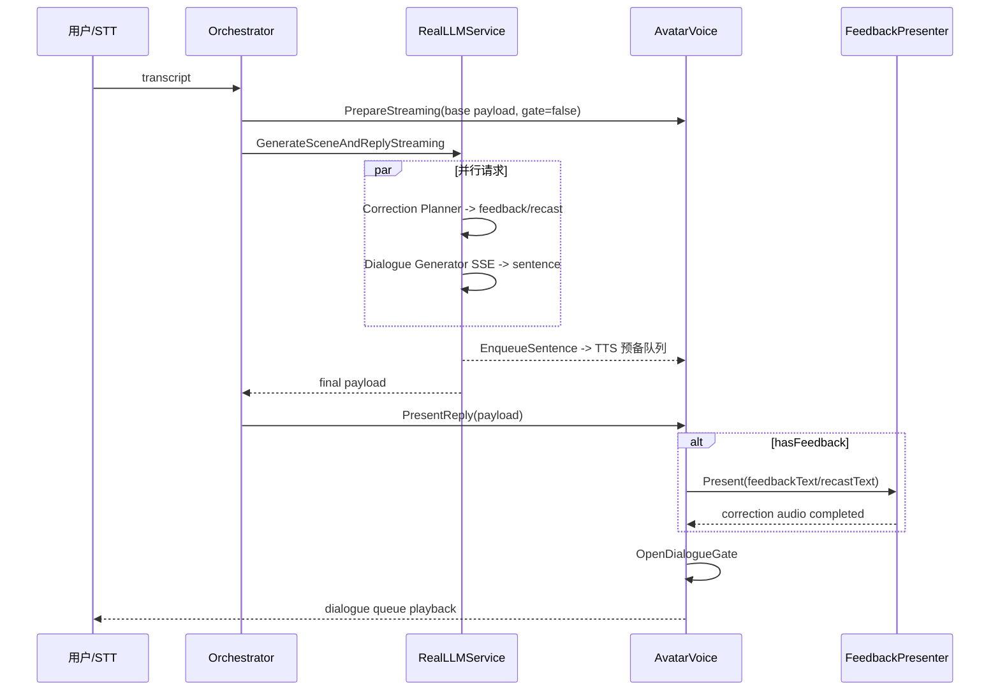

# SceneTalkVR 实验设计 v1.1 全量实现审计

审计日期：2026-07-17。审计对象为当前工作树 `spring-dev` (`26217df`)、`main`/`origin/main` (`8c5a7a9`)、`origin/edwin-dev` (`60c5328`) 及可见历史。结论以 C#、Unity YAML Scene/Asset、Prefab 和 Git 可达对象为证据；提交说明和项目内规划文档不单独作为实现证据。

## 审计边界与分支结论

- 当前检出：`spring-dev`。`git log main..spring-dev` 显示固定场景、流式反馈、Avatar catalog 等实现尚未合并到 `main`；故除非特别注明，“当前实现”均为 **IMPLEMENTED_NOT_MERGED** 相对 `main`。
- `main` 只到 `8c5a7a9`，不包含 `spring-dev` 的后续实验改造。`origin/edwin-dev` 指向 `60c5328`，已被 `c0e9a1b` 合入当前 `spring-dev`，但未合入 `main`。
- 工作区另有未提交的 `SampleScene.unity`、`SceneTalkRuntimeConfig.asset` 变更和 `_Recovery` 场景；本审计仅以当前可读 YAML 描述实际绑定，不把未跟踪 Recovery 文件视为可交付功能。
- v1.1 基线来自所给 PDF：正式四任务为 Hotel Check-In、Furniture Shopping、Gym Membership、Tourist Assistance；正式条件为 NE/NR/SE/SR；预实验为餐厅场景中的 Voice Only/Floating Orb/Humanoid Agent；正式实验须有四条件顺序、后测问卷、排序与访谈。

状态枚举只使用：`COMPLETE`、`PARTIAL`、`SKELETON`、`NOT_IMPLEMENTED`、`IMPLEMENTED_NOT_MERGED`、`UNKNOWN`。

## 1. Feedback First 与流式播放调度

状态：PARTIAL

负责人/分支：`spring-dev`；主要提交 `0ab7775`、`9174a81`、`7e5bc2d`、`fb41506`、`d21f674`、`26217df`；均未合入 `main`。

代码证据：`RealLLMService.GenerateSceneAndReplyStreaming` 同时创建 `ParseCorrectionFeedbackAsync` 与 `ParseDialogueContinuationStreamingAsync`（约 1057-1061 行）；前者要求 explicit 的统一 `feedbackText`、recast 的统一 `recastText`（245-264 行），后者明确“Do NOT duplicate or include any grammatical corrections”（1133 行）。`AvatarPresentationVoiceModule.PrepareStreaming` 关闭 `isDialogueGateOpen`（700-708 行），`EnqueueSentence` 会预备 TTS 队列（743-759 行），`PresentReply` 的通常分支先 `CorrectionFeedbackPresenter.Present` 再 `OpenDialogueGate`（231-275 行）。

涉及文件：

- `Client/Assets/SceneTalkVR/Scripts/Services/RealLLMService.cs`
- `Client/Assets/SceneTalkVR/Avatar/Scripts/AvatarPresentationVoiceModule.cs`
- `Client/Assets/SceneTalkVR/Avatar/Scripts/CorrectionFeedbackPresenter.cs`
- `Client/Assets/SceneTalkVR/Scripts/Core/SceneTalkOrchestrator.cs`

核心类与方法：`ParseCorrectionFeedbackAsync`、`ParseDialogueContinuationStreamingAsync`、`GenerateSceneAndReplyStreaming`、`PrepareStreaming`、`EnqueueSentence`、`OpenDialogueGate`、`PresentReply`、`CorrectionFeedbackPresenter.Present`。

运行时调用链：

数据结构与字段：`CorrectionFeedbackData.hasFeedback/provider/style/feedbackText/recastText/originalText/correctedText`；`SpringScenePayload.dialogueReply/dialogueContinuation`；`isDialogueGateOpen`、两个 streaming queue、各播放时间字段。

Inspector/资源依赖：场景 `SampleScene.unity` 的 `AvatarPresentationVoiceModule`、`CorrectionFeedbackPresenter`、`CorrectionAgentPresenter` 必须有效绑定；Voice Gateway/TTS 必须可用。

已经实现的行为：Planner 与 dialogue 请求并行；dialogue 能逐句入 TTS 队列；有反馈的通常路径固定为 feedback 后打开 gate，无反馈会直接打开 gate；provider 路由只决定 Avatar/Agent 播放主体，文本由 Planner 统一生成；recast 有独立 `recastText`，且 dialogue prompt 禁止纠错。正式锁定模式禁用 debug-force feedback，并有 STT 抑制、45 秒 HTTP timeout、TTS/Avatar 失败时的语音 fallback。

尚未实现或不完整的行为：没有独立的 `CorrectionPlanner` 类型/服务边界，仍同属 `RealLLMService`；无正式实验专用超时降级状态机。`RecordTurnMetrics` 在对话完成后用“当前 UTC”填 request start，`timeoutReason/fallbackReason/failureReason` 固定为 `none`，不是真实时序。`PresentReply` 若已提前 `isDialogueGateOpen`，会先等待流式对话结束后再播 feedback（168-207 行），这是与 Feedback First 相反的备用分支；通常 orchestrator 路径不会预先开 gate，但该分支仍是风险。没有自动测试证明 Avatar/Agent 的四组合逐条播放不重复。

与 v1.1 的差异：核心意图已接近，但“严格”顺序仅对常规路径有代码保证，不能称端到端验证完成。

合并依赖与冲突风险：与 `main` 的 `RealLLMService`、`SampleScene.unity`、Avatar voice 模块高度冲突；合并 `edwin-dev` 后应保留 `26217df` 的 second-person recast guard 与 `d21f674` 队列修复。

验证方法：在 Editor 和 PICO 分别对四条件注入一条可纠错 STT，检查 JSONL 的 `playbackOrder`、真实 play timestamps、音频录制及 Avatar/Agent 文本一致性；再模拟 Planner、SSE、TTS 各自 timeout。

建议下一步：将 Planner/Dialogue/PlaybackGate 显式建模；把真实 monotonic timestamps、失败原因和 gate 分支写入日志，并加 PlayMode 测试。

## 2. 固定场景系统

状态：PARTIAL

负责人/分支：`spring-dev`，提交 `c0874cc`、`49688d8`，未合入 `main`。

代码证据：`SceneTalkRuntimeConfig.useFixedExperimentMode=true`、`useHolodeckBackend=false`、`onlyUsePanorama=true`、`forceFallbackPanorama=true`；`SceneTalkFlowUiController` 创建四按钮并调 `ConfirmFixedTaskSelection`（160-174、279-297 行）；`SceneTalkOrchestrator.RunFixedTaskStartup` 直接以 `SceneTalkExperimentTask` 创建 initial payload（203-318 行），没有首轮 scene-intent LLM 调用。`PanoramaSceneService.GenerateSkyboxAsync` 对 `demo://` 从 `Resources/SceneTalkVR/Textures/` 加载。

涉及文件：`SceneTalkRuntimeConfig.cs/.asset`、`SceneTalkFlowUiController.cs`、`SceneTalkOrchestrator.cs`、`ExperimentConditionManager.cs`、`PanoramaSceneService.cs`、`HybridScenePresenter.cs`。

核心类与方法：`ConfirmFixedTaskSelection`、`RunFixedTaskStartup`、`SelectTask`、`GenerateSkyboxAsync`、`HybridScenePresenter.PresentScene`。

运行时调用链：Start -> `Listening` -> TaskSelectionPanel -> `SelectTask` -> fixed initial payload (`initialQuestion`, `demo://...`) -> Hybrid presenter -> local Resources panorama -> Avatar initial question -> 多轮 `RealLLMService`（仅 role/environment/task context）。

数据结构与字段：`SceneTalkExperimentTask` 有 `scenarioId/context/goals/initialQuestion/fallbackEnvironmentType/fallbackAvatarRole/fallbackSkyboxUrl/fallbackLayoutObjects`。

Inspector/资源依赖：`SceneTalkRuntimeConfig.asset`；`SampleScene.unity` 的 `HybridScenePresenter.onlyUsePanorama: 1`；本地已见 `restaurant-360.png`、`furniture-store-360.png`、`gym-360.png`、`hotel-lobby-360.png` 和 `FallbackPanorama.png`。

已经实现的行为：固定任务按钮、固定 initial question、固定本地全景优先及本地 fallback；当前有效配置不调用 Holodeck，也不生成近景 3D。后续 LLM 对话仍以固定 task 的 environment/role 注入。

尚未实现或不完整的行为：泛化路径仍可调用 SiliconFlow image API（`forceUseFallback=false`）和 Holodeck（`onlyUsePanorama=false`），不是代码层删除；`fallbackLayoutObjects` 仍进入 payload，虽当前 presenter 配置跳过。用户“换场景”是重新显示/选择任务，未实现自然语言换场景意图的明确拒绝/引导策略。没有 Tourist panorama。

与 v1.1 的差异：固定模式存在，但仍是可切换的旧生成系统，不是不可变的正式实验锁定场景管线。

合并依赖与冲突风险：`SceneTalkRuntimeConfig.asset` 和 `SampleScene.unity` 现为脏工作树，先人工确认保存版本；`HybridScenePresenter` 同时保留旧 Holodeck 接口。

验证方法：断网运行四任务，检查日志 `sceneMode=fixed_panorama`、`whetherHolodeckCalled=false` 与加载 texture 名称。

建议下一步：正式模式硬禁止生成 API/布局，补 Tourist asset，并把“换场景”收敛为实验员允许的任务选择。

## 3. 正式实验四个任务

状态：PARTIAL

负责人/分支：`spring-dev`；任务定义在当前 Scene YAML 与 `ExperimentConditionManager.CreateDefaultTasks`，未合入 `main`。

代码证据：`CreateDefaultTasks`（896 行起）和 `SampleScene.unity`（6564 行起）都有 Restaurant、Furniture、Gym、Hotel；全文代码/资产搜索无 `tourist` 运行时任务或 panorama。任务面板仍显示 Restaurant（`SceneTalkFlowUiController.cs:164`）。

涉及文件：`ExperimentConditionManager.cs`、`SceneTalkContracts.cs`、`SampleScene.unity`、`SceneTalkFlowUiController.cs`、`AvatarCatalog.asset`。

核心类与方法：`CreateDefaultTasks`、`SelectTask`、`RunFixedTaskStartup`。

运行时调用链：任务 button 的硬编码 `scenarioId` -> `SelectTask` -> cloned task -> initial payload -> `AvatarPresetResolver.Resolve(payload.taskType)`。

数据结构与字段：下表字段均来自 `SceneTalkExperimentTask`；没有独立的 `taskId`、`avatarPresetKey`、任务 role prompt、goal tracking schema。

| v1.1 任务 | 当前 scenarioId | context/goals/initialQuestion | panorama | avatar preset/role | 结论 |
|---|---|---|---|---|---|
| Hotel Check-In | `hotel_check_in` | 有，4 goals；hotel welcome question | `demo://hotel-lobby-360` | `teacher_female_humanoid_v1` / task role `clerk` | PARTIAL，角色语义不一致 |
| Furniture Shopping | `furniture_shopping` | 有，4 goals；HomeSpace desk question | `demo://furniture-store-360` | `teacher_humanoid_v1` / `clerk` | PARTIAL，非店员形象 |
| Gym Membership | `gym_membership` | 有，4 goals；FitZone question | `demo://gym-360` | `barista_male_humanoid_v1` / `instructor` | PARTIAL，非教练形象 |
| Tourist Assistance | 无 | 无 | 无 | 无 | NOT_IMPLEMENTED |
| 旧 Restaurant Reservation | `restaurant_reservation` | 有，仍是默认 task、首个按钮和 avatar mapping | `demo://restaurant-360` | `barista_humanoid_v1` | 仍在正式候选配置，未替换 |

Inspector/资源依赖：`SampleScene.unity` 序列化的 task definitions 与 `Avatar/Catalogs/AvatarCatalog.asset`；前者和代码 default tasks 文案不完全相同，存在双源漂移。

已经实现的行为：前三个目标、上下文、initial question、四张本地图、全局 task 元字段与每 turn 日志中的 `selectedTaskId/taskContext/taskGoals/initialQuestion`。

尚未实现或不完整的行为：Tourist、四任务 task panel、task-specific LLM role prompt（只有 role/environment 插值）、goal tracking、task completion、正式四任务分配均缺失；Restaurant 尚未移除。

与 v1.1 的差异：3/4 任务只是任务文本/背景/预设映射，不能称“完整进入代码”。

合并依赖与冲突风险：应先统一 YAML taskDefinitions 与 `CreateDefaultTasks` 单一数据源，再改 catalog；否则会出现 UI/日志/LLM 文案不一致。

验证方法：选择每个任务，检查 Resources 加载、Avatar catalog 命中、初始句与日志字段；Tourist 应在补齐后做同样验证。

建议下一步：删/迁移 Restaurant，新增 `tourist_assistance` 的所有资源与 catalog 条目，建立单一 ScriptableObject task catalog。

## 4. Avatar 固定预设系统

状态：IMPLEMENTED_NOT_MERGED

负责人/分支：`spring-dev`，提交 `6384089`；相关 `origin/edwin-dev` 已经由 `c0e9a1b` 纳入 spring-dev，未进 main。

代码证据：`AvatarPresetResolver.Resolve` 直接 `catalog.FindByScenarioId(payload.taskType)`，返回 `score=0`，不再执行打分；找不到映射时 `catalog.GetDefault()`。`AvatarCatalog.asset` 有四条 `scenarioIds` 映射。

涉及文件：`AvatarPresetResolver.cs`、`AvatarCatalog.cs`、`AvatarPresetEntry.cs`、`Avatar/Catalogs/AvatarCatalog.asset`、`AvatarPresentationVoiceModule.cs`、`SampleScene.unity`。

核心类与方法：`AvatarPresetResolver.Resolve`、`AvatarCatalog.FindByScenarioId/GetDefault`、`AvatarPresentationVoiceModule.EnsureAvatar`。

运行时调用链：fixed payload `taskType` -> resolver scenario lookup -> `PrefabAvatarInstanceLoader` -> prefab -> `AvatarAnimationDriver`；加载失败可由 `allowVoiceFallbackOnAvatarFailure=true` 保持音频。

数据结构与字段：`AvatarPresetEntry.key/prefab/addressableKey/scenarioIds/roles/.../mobileReady`。当前 catalog 映射为 Restaurant -> `barista_humanoid_v1`，Furniture -> `teacher_humanoid_v1`，Gym -> `barista_male_humanoid_v1`，Hotel -> `teacher_female_humanoid_v1`；没有 Tourist。

Inspector/资源依赖：`SampleScene.unity:6454-6455` 已把 resolver 指向 catalog；prefab assets 位于 `Assets/SceneTalkVR/Avatar/Prefabs/Humanoid/`；voice 的默认和 Animator 是 `AvatarPresentationVoiceModule` 的 Inspector 字段，catalog 本身没有 `voiceId`、位置、朝向字段。

已经实现的行为：固定 scenario lookup、默认 fallback、四个 prefab 引用、`mobileReady` 标记及 Animation controller 支持。

尚未实现或不完整的行为：没有按 `taskId` 单独映射（只用 `scenarioId`）；没有在 preset 中固化 voiceId/Animator/position/orientation，仍需 Scene component/Prefab Inspector；Gym/Hotel/Furniture 的视觉职业与任务角色不匹配；无 Tourist fallback 之外的映射。

与 v1.1 的差异：固定 avatar resolver 达到主要架构要求，但四个正式任务与角色资源尚未完成。

合并依赖与冲突风险：`AvatarCatalog.asset`、`SampleScene.unity` 与 Avatar scripts 都可能同 `main`/Edwin 变更冲突；应先保留 GUID 引用，再人工核查 prefab animator/voice。

验证方法：四任务启动后记录 `AvatarResolutionResult.avatarKey/fallbackLevel`（目前未写入实验日志，需 Console/Inspector 观察）；故正式可重复性仍未由数据证明。

建议下一步：把 voice/transform/Animator 归入 preset，并新增 Tourist 的服务台形象和 fallback audit log。

## 5. 预实验三种反馈 Agent

状态：PARTIAL

负责人/分支：`spring-dev`；`7a7c9af`、`bbbbccb`、`60c5328`，未合入 main。

代码证据：`CorrectionAgentPresenter.VisualMode` 仅有 `GeneratedAgent` 和 `PrefabAvatar`；生成体会创建 AudioSource/Light、浮动/脉冲/朝向摄像机动画；`CorrectionFeedbackPresenter` 可在 Agent 分支把同一 feedback text 路由到该 AudioSource，且语音 ID 是 Inspector enum。场景实际为 `visualMode: 1` (`PrefabAvatar`) 但 `avatarPrefab: {fileID: 0}`（`SampleScene.unity:6681-6682`），因此该分支会退为生成球形实体。

涉及文件：`CorrectionAgentPresenter.cs`、`CorrectionFeedbackPresenter.cs`、`SampleScene.unity`、`Quirky Series Ultimate/FREE/Prefabs/Sparrow.prefab`。

核心类与方法：`SetVisible/HideImmediate/BeginSpeaking/EndSpeaking`、`EnsureAgent`、`CorrectionFeedbackPresenter.Present`。

运行时调用链：condition provider `assistant_agent` -> Presenter sets Agent visible -> request 的 `audioSourceOverride=correctionAgent.AudioSource` -> TTS -> Begin/EndSpeaking -> visibility restore。

数据结构与字段：`visualMode/avatarPrefab/avatarIdleState/avatarTalkState/localOffset/audioSource`；TTS `assistantAgentVoiceType`。没有 `embodimentCondition` 枚举。

Inspector/资源依赖：当前 Agent root、AudioSource、Light 是 Scene 引用；Humanoid 模式必须手工赋 `avatarPrefab` 与动画 state。没有 3D spatializer/PICO spatial audio component 的代码赋值证据。

已经实现的行为：Floating Orb（生成体）视觉、AudioSource、可见/隐藏、音频响应动画、同一 Planner 文本的 Agent 路由；Humanoid prefab 的代码路径存在。

尚未实现或不完整的行为：Voice Only 无 condition/config（只是“Agent 缺失时 audio-only fallback”）；三形态没有配置选择、独立 voice 控制、试次循环、无放回任务分配或排序问卷；当前 Scene 的 humanoid prefab 未赋值，不能证实可运行。没有证据可确认空间音频、三者音色/延迟/额外 UI 等混杂变量得到控制。

与 v1.1 的差异：不是预实验三条件系统，只是一个可切换视觉实现的 Agent presenter。

合并依赖与冲突风险：`CorrectionAgentPresenter` 与 `SampleScene` 的可见性/Prefab 引用为主要冲突面；需避免把 `PrefabAvatar` + 空 prefab 当成人形条件。

验证方法：为三种条件创建显式 config，采集同一 feedback text 的 actor、voiceId、距离、TTS latency、AudioSource spatial settings、显示生命周期；连跑 a/b/c。

建议下一步：新增 `EmbodimentCondition`（VoiceOnly/Orb/Humanoid）和正式预实验 session allocator，完成真机声场测试。

## 6. 正式条件编码与实验分配

状态：PARTIAL

负责人/分支：`spring-dev`，`ExperimentConditionManager`，未合入 main。

代码证据：枚举和 `GetConditionId` 使用 `dialogue_avatar_explicit/recast`、`assistant_agent_explicit/recast`；`ResolveCondition` 映射 provider/style。`conditionOrder` 只是 Inspector string array，`AdvanceCondition` 循环前进。

涉及文件：`ExperimentConditionManager.cs`、`SceneTalkContracts.cs`、`SampleScene.unity`。

核心类与方法：`ResolveCondition`、`NormalizeConditionId`、`GetEffectiveConditionOrder`、`AdvanceCondition`、`BeginTurn`。

运行时调用链：Inspector `manualCondition` 或 array index -> conditionId -> provider/style -> 注入 LLM 与 voice presenter -> turn log。

数据结构与字段：`participantId/sessionId/conditionId/scenarioId/provider/style/conditionOrder/conditionOrderIndex`。

Inspector/资源依赖：当前 Scene `useConditionOrder: 0`，manualCondition `0`，顺序为 dialogue explicit -> dialogue recast -> agent explicit -> agent recast，且默认 scenario 是 Restaurant。

已经实现的行为：旧名到新名可人工映射：NE=`dialogue_avatar_explicit`，NR=`dialogue_avatar_recast`，SE=`assistant_agent_explicit`，SR=`assistant_agent_recast`；可手动指定一个四项 order，并有 condition index 写日志。

尚未实现或不完整的行为：代码中没有 `NE/NR/SE/SR` 码；没有 a/b/c/d 显式映射、四个 Latin/cyclic order 模板、participantId->sequence、condition×task 随机化、参与者内 task 无重复/跨参与者平衡；`AdvanceCondition` 不会换 task/清 history/reset avatar/scene。`Exit` 才清 Brain history，故条件连续切换会保留上下文。

与 v1.1 的差异：当前是调试 Inspector 的条件轮换，不是正式实验分配器。

合并依赖与冲突风险：未来 allocator 会替换 `conditionOrder` 与 `scenarioIndex` 的控制权，避免 UI button 和手动 Inspector 同时改写。

验证方法：为 8+ participantId 生成分配表，断言每人四条件/四任务各一次，跨人均衡；条件转换前后断言 RealLLM history、Avatar、Scene、log session 已 reset。

建议下一步：实现不可变 `ExperimentAssignment` 与 persistent session state，日志使用 NE/NR/SE/SR 和 sequenceId。

## 7. 任务面板与 Goal Tracking

状态：NOT_IMPLEMENTED

负责人/分支：无运行时代码证据；`next_phase/outline.md` 仅为设计材料，不计实现。

代码证据：`SceneTalkFlowUiController` 的 `TaskSelectionPanel` 只在开始前显示任务文字；`SceneTalkExperimentTask.goals` 仅被拼接为日志 `taskGoals`。在 runtime C# 中未发现 Goal/Checklist/Completion tracker 或实验员复核类型。

涉及文件：`SceneTalkFlowUiController.cs`、`ExperimentConditionManager.cs`、`SceneTalkContracts.cs`、`SampleScene.unity`。

核心类与方法：仅有 `CreatePanel`/`ConfirmFixedTaskSelection` 与 `CreateTurnLog`，没有 tracking 方法。

运行时调用链：TaskSelectionPanel -> task id -> initial payload；goals 不流向对话 UI 或完成判定。

数据结构与字段：有 `goals` 和日志字符串 `taskGoals`，没有 goal state、completion rate、turns-to-completion、reviewer 字段。

Inspector/资源依赖：Scene UI 层级包含 `TaskSelectionPanel`、`DialoguePanel`、subtitle 等，不包含 task checklist panel。

已经实现的行为：开始前可选任务并看到静态 context/goals 摘要。

尚未实现或不完整的行为：VR 内任务面板、显示/隐藏、手动勾选、LLM 判断、实验员复核、完成率、完成回合数、结束条件全部缺失。

与 v1.1 的差异：v1.1 的任务完成数据目前不能采集。

合并依赖与冲突风险：新 UI 要与现有 `SceneTalkFlowUiController` 动态 Canvas 同层，且需定义实验员接口。

验证方法：补实现后测试每一目标的手动/自动/复核事件及写入 JSONL。

建议下一步：先定义 task/goal completion schema，再实现只读面板和人工复核，LLM 自动判断作为可审计辅助。

## 8. 问卷、排序和访谈流程

状态：NOT_IMPLEMENTED

负责人/分支：无。

代码证据：`SceneTalkState` 虽有 `Questionnaire` 枚举值，但代码搜索未找到 Questionnaire manager、UI、题项、response model、保存或导出调用；无 Role Clarity、IMI、Learning Support、ranking/interview 的 C# 实现。

涉及文件：`SceneTalkState.cs`、`SceneTalkFlowUiController.cs`、`ExperimentConditionManager.cs`。

核心类与方法：仅 `SceneTalkState.Questionnaire` 占位，无进入/退出/提交方法。

运行时调用链：不存在。

数据结构与字段：不存在问卷 response、反向题、participant/session/condition/task linkage key 或 export schema。

Inspector/资源依赖：SampleScene 无 QuestionnairePanel；现有 Canvas 仅含菜单、任务选择、请求、字幕与设置 UI。

已经实现的行为：无；`Questionnaire` 是 SKELETON 状态标识，不是问卷实现。

尚未实现或不完整的行为：PDF 所列 Role Clarity、Conversation Continuity、IMI 5+2、Learning Support 4、反向题、每条件后问卷、四条件排序+理由、预实验三形态排序、访谈、数据导出均缺失。

与 v1.1 的差异：测量与偏好数据链路为零。

合并依赖与冲突风险：需与 assignment/session log 共同设计 key，不能之后靠文件名关联。

验证方法：四条件 session 生成完整 response JSON/CSV，检查反向题原值与计分值、排序不重复、open text 可导出。

建议下一步：优先实现持久化问卷 schema 与最小 UI。

## 9. 实验日志

状态：PARTIAL

负责人/分支：`spring-dev`；主要 `454dba9`、`1ec0079`，未合入 main。

代码证据：`ExperimentConditionManager.WriteTurnLog` 同时 `JsonUtility.ToJson(record)` 写 `.jsonl` 和 `ToCsvLine` 写 CSV（609-657 行），目录为 `Application.persistentDataPath/SceneTalkVR/ExperimentLogs`。字段定义与 CSV header 位于 `ExperimentTurnLogRecord`（1046 行起）。

涉及文件：`ExperimentConditionManager.cs`、`SceneTalkOrchestrator.cs`、`RealLLMService.cs`。

核心类与方法：`BeginTurn/CreateTurnLog`、`RecordSpeechMetadata`、`RecordCorrectionPayload`、`RecordCorrectionPlayback`、`RecordDetailMetrics`、`WriteTurnLog`。

运行时调用链：capture -> `RecordSpeechMetadata` -> LLM payload -> `RecordCorrectionPayload` -> avatar event -> `RecordCorrectionPlayback` -> `RecordTurnMetrics` -> `RecordUserAction` 写盘。

数据结构与字段：真实 record/header 包含 `participantId,sessionId,conditionId,scenarioId,turnId,turnIndex,provider,style,hasFeedback,errorType,correctionOutcome,correctionErrorCode,userAction,retryCount,recordingDurationMs,moduleFallback,timestampUtc,timestampUnixMs,completedAtUtc,transcript,dialogueReply,feedbackText,originalText,correctedText,rationaleTag,sttConfidence,sttProvider,sttFallbackLevel,sttSuppressionReason,conditionOrderPosition,validationWarnings,selectedTaskId,taskName,taskContext,taskGoals,initialQuestion,sceneMode,whetherHolodeckCalled,panoramaSource,experimentProvider,experimentStyle,dialogueContinuation,recastText,correctionRequestStartTime,dialogueRequestStartTime,firstTokenTime,firstSentenceTime,ttsReadyTime,correctionPlayStartTime,correctionPlayEndTime,dialoguePlayStartTime,dialoguePlayEndTime,playbackOrder,userEndToFeedbackAudioMs,userEndToDialogueAudioMs,feedbackToDialogueGapMs,correctionVoiceId,actualPlaybackSubject,timeoutReason,fallbackReason,failureReason`。

Inspector/资源依赖：`enableLogging/writeJsonLines/writeCsv/logFolderName` 在 `ExperimentConditionManager` Inspector；当前 Scene 都为 enabled。

已经实现的行为：JSONL/CSV、基本 participant/session/条件/文本/STT/重试/任务元数据、播放 actor 与部分 latency 字段会写入。

尚未实现或不完整的行为：没有 `experimentPhase`、NE/NR/SE/SR、`embodimentCondition`、`sequenceId`、`taskAssignmentId`、goal completion、questionnaire linkage、technicalInvalidTurn；`conditionOrder` 全数组不写（仅 position）。request start 使用记录时的 UTC 而非实际请求时刻；first token/TTS/播放是混合延迟数值却命名为 Time；timeout/fallback/failure 固定 `none`，`correctionVoiceId` 也被硬编码为 `WeJames`/`TencentVoice`，与 Inspector 实际选择可能不一致。故“字段定义”不等于“真实写入”。

与 v1.1 的差异：已有基础逐回合日志，但不能支撑完整实验分配、问卷关联与可靠 performance analysis。

合并依赖与冲突风险：`ExperimentTurnLogRecord` 扩字段会改变 CSV schema；须版本化 header，避免分析脚本读错列。

验证方法：在真实 Editor/PICO run 读取生成 JSONL，逐字段与 Console/TTS 时间线对账；故障注入后确认 fallback/error 非空。

建议下一步：改成 event-based JSONL（请求/首 token/TTS/playback/问卷事件），补 assignment 和 questionnaire keys，并记录真实 monotonic timestamp。

## 10. PICO 与端到端稳定性

状态：UNKNOWN

负责人/分支：`spring-dev` 有 Editor 工具与 PICO 配置代码，未合入 main。

代码证据：`SceneTalkPreflightMenu` 只实现配置/检查 Android、OpenXR、PICO profile、LAN URL 的 Editor menu；它明确要求真实 PICO 使用 LAN 而非 `127.0.0.1`。当前 `RuntimeConfig.asset.voiceGatewayBaseUrl` 是 `http://127.0.0.1:8787`，不适合 PICO 真机。当前项目代码没有设备测试 harness、APK artifact、设备日志或 CI result 可供证实。

涉及文件：`SceneTalkPreflightMenu.cs`、`SceneTalkAndroidBuildPostprocessor.cs`、`SceneTalkRuntimeConfig.cs/.asset`、`VoiceGatewayClient` 相关脚本、`ProjectSettings`。

核心类与方法：`ConfigurePicoOpenXRDefaults`、`RunPreflightCheck`、`ConfigurePicoRealRunDefaults`。

运行时调用链：配置菜单 -> PlayerSettings/OpenXR 检查；不能代表 build/install/run。

数据结构与字段：PICO/Android 项目设置、Voice gateway URL、Holodeck URL；没有 test-result 数据结构。

Inspector/资源依赖：Android build support、PICO device developer mode、LAN speech/TTS service、microphone permission、本地 Resources texture。

已经实现的行为：PICO/Android 预检和配置代码存在，固定本地资源能减少网络背景依赖。

尚未实现或不完整的行为：没有代码证据证明四正式条件在 Editor/PICO 均跑通、四任务均可加载、三 Agent 形态均可运行、连续四条件不会泄漏、LAN/mic/STT/TTS 稳定、Android build 或 preflight 已通过。编译或菜单存在均不构成真机验证。

与 v1.1 的差异：端到端可用性和设备验证尚不可确认。

合并依赖与冲突风险：真机 runtime config 与当前 loopback asset 必然冲突；应使用未提交到仓库的部署配置或安全的 LAN override。

验证方法：建立 Editor/PICO 验收矩阵与设备 log 附件，逐一执行四条件×四任务和预实验 3 形态；对四条件连跑检查 `ResetSession`、scene/avatar reset 和文件记录。

建议下一步：先完成 P0 产品缺口后，进行带版本号、设备型号、APK hash、LAN endpoint、mic/TTS 数据的测试记录。

## 最终汇总

### 全量状态矩阵

| 审计项 | 当前工作树 | 相对 main | 关键结论 |
|---|---|---|---|
| Feedback First/streaming | PARTIAL | IMPLEMENTED_NOT_MERGED | 并行与 gate 存在，备用分支/真实时序不完整 |
| 固定场景 | PARTIAL | IMPLEMENTED_NOT_MERGED | 本地 panorama 已用，旧生成路径仍可启用 |
| 四正式任务 | PARTIAL | IMPLEMENTED_NOT_MERGED | 仅前三 + Restaurant；无 Tourist |
| 固定 Avatar | IMPLEMENTED_NOT_MERGED | IMPLEMENTED_NOT_MERGED | scenario 直映射，资源/语义/voice metadata 不完整 |
| 三预实验 Agent | PARTIAL | IMPLEMENTED_NOT_MERGED | Orb 与 humanoid code path；无 VoiceOnly/allocator |
| 条件编码与分配 | PARTIAL | IMPLEMENTED_NOT_MERGED | 旧四组合可手动轮换；无 NE allocator/平衡 |
| 任务面板/goal tracking | NOT_IMPLEMENTED | NOT_IMPLEMENTED | 仅开始前 selection UI |
| 问卷/排序/访谈 | NOT_IMPLEMENTED | NOT_IMPLEMENTED | 仅 `Questionnaire` enum 占位 |
| 日志 | PARTIAL | IMPLEMENTED_NOT_MERGED | 基础 JSONL/CSV；关键字段是假值或缺失 |
| PICO E2E | UNKNOWN | UNKNOWN | 有预检代码，无运行证据 |

### 已完成项目

- 固定 scenarioId 的 Avatar catalog resolver（当前 `spring-dev`，但未合入 main）。
- 基础逐回合 JSONL/CSV 写盘。
- 固定模式下的本地 `demo://` panorama 加载和 fallback。
- Planner/dialogue 两条异步请求与 dialogue TTS 预队列的基础实现。

### 已实现但未合并项目

- `spring-dev` 的固定场景/任务选择（`c0874cc`、`49688d8`）。
- `spring-dev` 的 fixed avatar mapping（`6384089`）。
- Agent/Orb 与 embodied feedback 路由（`7a7c9af`、`60c5328`）。
- streaming/gate/recast guard（`0ab7775`、`7e5bc2d`、`d21f674`、`26217df`）。

### 待确认项目的最终结论

- 四条件 Editor 跑通：UNKNOWN。
- 四条件 PICO 跑通：UNKNOWN。
- PICO Android build/preflight 已通过：UNKNOWN。
- Humanoid Agent 在当前 Scene 可运行：UNKNOWN（模式为 PrefabAvatar，但 prefab 为空）。
- 空间音频是否工作：UNKNOWN。
- 无上下文泄漏的连续四条件 session：NOT_IMPLEMENTED（切条件不 reset history）。

### 队友开发内容、提交与合并依赖

- `origin/edwin-dev`：`60c5328 feat: refine avatar presentation and assistant visibility`；已合入 spring-dev（`c0e9a1b`），待随 spring-dev 进 main。
- `spring-dev`：上述所有核心实验改造；与 main 的高冲突文件为 `SampleScene.unity`、`RealLLMService.cs`、`ExperimentConditionManager.cs`、`AvatarPresentationVoiceModule.cs`、RuntimeConfig/catalog assets。
- 合并前应先冻结并审查当前 Scene/RuntimeConfig 脏工作区，避免把本机 loopback 和实验调试状态带入正式分支。

### P0/P1/P2 缺口

- P0：Tourist Assistance 全链路；正式分配器（NE/NR/SE/SR、四顺序、task 无重复、reset）；问卷/排序/导出；goal tracking；修正流式备用路径与真实日志时间；PICO/LAN 实机验收。
- P1：将 task/preset/voice/placement 收敛到单一 ScriptableObject；补 Agent 三形态、空间音频与变量控制；日志 schema version/event log。
- P2：自动化 PlayMode/设备回归、实验员复核工具、分析导出与数据质量 dashboard。

### 需要人工确认的实验设计问题

- Split 是否严格等同 `assistant_agent`，Non-Split 是否严格等同 `dialogue_avatar`；建议在代码和对外数据统一为 NE/NR/SE/SR。
- 每个固定场景的角色职业、voice、位置、朝向是否已由研究团队认可；现有 catalog 显示明显错配。
- 预实验 Voice Only 是否需要无视觉但保留同一空间 AudioSource，还是完全非空间声源；这影响混杂控制。
- 场景切换是否允许参与者自由操作，或仅实验员按 assignment 驱动。

### 需要 Unity Inspector 手工操作的项目

- 为 PICO 把 `voiceGatewayBaseUrl` 从 `127.0.0.1` 改为可访问 LAN 地址。
- 设定正式 `participantId`、`sessionId`、condition/task assignment；当前 Scene 是 demo/Restaurant/debug。
- 为 Humanoid Agent 赋 `avatarPrefab`、Animator states、位置/朝向，并验证 AudioSource spatial 参数。
- 为新增 Tourist task 指派 texture、avatar prefab、voice、placement；检查 catalog GUID 与 Scene resolver 引用。

### 下一轮建议开发顺序

1. 冻结 v1.1 数据模型：四 task、四 condition、assignment、goal、questionnaire、event log。
2. 补 Tourist 并移出正式 Restaurant；统一 task 数据源和 avatar/voice/placement preset。
3. 实现 session allocator/reset 与任务/goal panel。
4. 实现问卷、排序、访谈和导出。
5. 固化 Feedback First state machine，补故障日志与测试。
6. 完成预实验三形态并做 Editor/PICO 验收。

### 是否具备开展实验的条件

预实验：**否**。Orb/Agent 原型可演示，但没有 Voice Only、三条件分配、餐厅任务无放回和排序问卷。

正式实验：**否**。缺 Tourist、正式分配/重置、goal tracking、问卷/导出及 PICO 端到端证据；且核心实现尚未合入 `main`。
