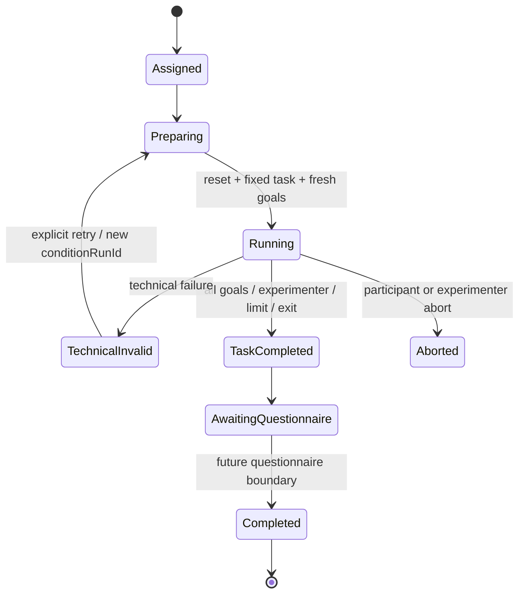

# Experiment v1.1 Stage 4 — Assignment、条件生命周期与 Goal Tracking

## 结论

阶段 4 在 `experiment-v1.1-integration`、基线 `3f1829c436eb1a55f9c2976d972dd3adf512d444` 上实现了可复现分配、条件边界、Goal Candidate/实验员确认、只读 VR 面板、恢复与独立 study event 日志。阶段 3 `FeedbackFirstPlaybackGate` 和 timing event schema 未修改。

正式协议资产仍保留五项 Unconfirmed 决策和空正式 sequence；Formal allocator 会明确失败，不会使用测试顺序或任务策略。四个正式 Avatar preset 阻断也未解除。

## Assignment 架构

`ExperimentCoreModel.cs` 提供 `ExperimentParticipant`、`ExperimentAssignment`、`ConditionAssignment`、`TaskAssignment`、`AssignmentSequence`、`AssignmentPolicy`、`AssignmentStatus` 与 `ConditionRunStatus`。`ExperimentAssignmentAllocator` 负责：

- SHA-256 稳定 seed；同 participant/protocol/allocator version 产生相同 sequence 和任务配对；
- 测试配置下四循环顺序、四条件各一次、StrictWithoutReplacement 四任务各一次；
- condition × task 使用 participant rotation 平衡；400 participant 自动测试通过；
- JSON 保存/恢复；协议、目录或 allocator version 变化时拒绝；
- Formal 加载验证四条件、任务 ID、位置、taskAssignmentId 和无放回唯一性；
- `developerTestAssignment=true` 永远不能进入 Formal Mode。

正式创建还要求 `condition_letter_mapping` 和 `formal_task_no_replacement` 已确认、任务策略值可解析、调用策略与协议一致、四个 sequence 均 confirmed。当前资产不满足，因此继续阻断。

## 条件生命周期

`ExperimentLifecycleCoordinator.PrepareCondition` 是条件启动唯一入口：

1. 拒绝已完成条件及未经授权的 TechnicalInvalid retry；
2. 调用 `ExperimentConditionManager.ResetConditionSessionBoundary`；
3. Stage 1 reset 广播清除 LLM/correction history、Avatar/Agent、TTS/AudioSource；
4. Stage 3 reset 清除 Gate、streaming queues 和 timing timeline；
5. 生成新的 `conditionRunId` 与 `questionnaireLinkageKey`；
6. 通过 `ApplyFormalAssignment` 锁定强类型 condition 和 participant/session；
7. 仅调用 Task Catalog 的 `LoadAssignedTask(taskId)`；
8. 用该任务四个 goals 初始化 tracker；
9. 写入 `ConditionPrepared`、`TaskLoaded`、`ConditionStarted`。

两个连续条件的组件级测试验证了 runId、固定任务、Goal 状态和 turn index 全部刷新。TechnicalInvalid retry 需要显式参数并增加 run attempt，旧 study/timing 日志不覆盖。

## Goal Tracking

`GoalProgressTracker` 管理 `NotStarted`、`Candidate`、`Confirmed`、`Rejected`。每条 `GoalProgressRecord` 包含 goal ID/text、candidate source、证据 turn/transcript、候选/确认时间、确认人和拒绝原因。

- 系统、Fake 或未来 LLM 只能调用 `SubmitGoalCandidate`；
- `ConfirmGoal`/`RejectGoal` 要求非空实验员身份且目标当前必须为 Candidate；
- Candidate 不计入 completion rate；
- 四个目标全 Confirmed 可自动结束任务；实验员也可在不足四个时结束；
- 最大回合、最大时长、技术失败和主动退出均有独立完成原因。

## VR 面板与实验员控制

`SceneTalkFlowUiController` 动态创建 `ReadOnlyTaskGoalPanel`，显示当前 task ID、四个 Goal 文本及真实状态。它位于主要字幕区侧面，可通过 `SetGoalPanelVisible` 显示/隐藏；面板 PlayMode 测试确认不含任何 Button。

`ExperimenterGoalControl` 只提供 Inspector/Editor ContextMenu 控制：Confirm、Reject、备注、Complete Task、Technical Invalid、Abort 和问卷占位边界。没有参与者可误触的普通 VR 控件。正式问卷内容未实现；条件结束固定停在 `AwaitingQuestionnaire`。

## 日志与恢复

Stage 3 timing JSONL 保持原 schema 和计算语义。新增 `<participant>_<session>_study_events_v1.jsonl`，schema 见 `EXPERIMENT_V1_1_STAGE4_STUDY_EVENT_SCHEMA.md`。

每个 workflow event 追加写入，包含 assignment、condition run、questionnaire linkage、goal、turn、actor、reason 和 technical validity。每次事件后保存 assignment snapshot。兼容 turn JSONL/CSV 新增 `sequenceId`、`conditionRunId`、`taskAssignmentId`、`assignmentVersion`、`questionnaireLinkageKey`、goal counts/rate、turns 与 completion reason。

## 测试专用协议隔离

四个测试循环顺序和 StrictWithoutReplacement 策略只在 `Stage4AssignmentGoalTests` 中以普通内存对象创建。没有修改 `ExperimentV11Protocol.asset`、没有确认任何正式决策，也没有向正式资产写入 a/b/c/d 映射。

## Unity 验证

- Unity 6000.3.16f1，复用已打开 Editor；未启动第二个进程。
- 最终 C# compile：通过，Console 0 error。
- 全量 EditMode：308/308，job `b60e1eade4664ca39a46868d57d024e1`；其中 Stage 4 定向测试 22 项。
- 全量 PlayMode：3/3，job `974c63d37a5940208b75f0689361ce45`。
- 测试 participant 连续准备/结束两个条件；验证 reset、task、goals、run IDs、Candidate、Confirm、Reject、AwaitingQuestionnaire 和 study events。
- Stage 2 四固定任务离线启动及 Stage 3 Feedback First/Gate/timing 测试均包含在回归结果中。
- 最小 Play Mode 进入/退出成功，Console 0 error。
- Preflight 无 Stage 4 新失败；只报告既有五项研究决策、Avatar preset、LAN/PICO/OpenXR 阻断。
- 未声称 PICO 通过。

## 已知风险

- 当前正式 sequence 和任务策略仍未确认，Formal allocator 按设计不可运行。
- Avatar preset 尚未提供，Formal 固定任务仍被验证器阻断。
- 实验员控制目前是 Editor/Inspector 入口；阶段 5 若开发桌面控制台，需要保持认证/隔离边界。
- `maxTurns` 和 `maxDurationMinutes` 默认 0 表示未设置，不会偷偷采用研究阈值；正式实验前必须明确配置。
- 本阶段未实现问卷内容、Preference Ranking、Pilot Agent 或 PICO 验收。

## 阶段 5 输入条件

1. 团队确认 condition mapping、正式任务策略及其协议字符串；
2. 在正式协议资产中提供四个 confirmed sequence；
3. 确认每条件最大回合/时长；
4. 问卷模块消费 `AwaitingQuestionnaire` 和 `questionnaireLinkageKey`，完成后调用唯一边界 API；
5. 若添加实验员桌面 UI，只调用 Coordinator 的 Confirm/Reject/Complete API；
6. 保持 Stage 3 timing stream 和 Stage 4 study stream 独立。

最终提交由 `feat(experiment): add assignment lifecycle and goal tracking` 标识；精确 SHA 在提交后交付，避免报告自引用改变提交哈希。
