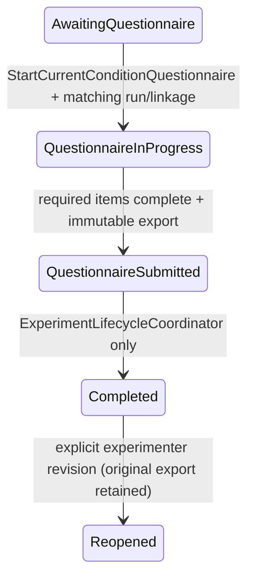

# Experiment v1.1 Stage 5 Questionnaire, Ranking and Measurement Pipeline

## Baseline and scope

- Branch: `experiment-v1.1-integration`
- Starting commit: `0a490e5cd0cb00f26fdce046ff851f424a7a5906`
- Final commit: the commit containing this report; the immutable SHA is recorded in the delivery handoff because a commit cannot contain its own SHA.
- Unity: `6000.3.16f1`, existing `Client@16ed13d125de1334` Editor only.
- Stage 3 `FeedbackFirstTurnModel` and timing event schema were not modified.
- The five unconfirmed research decisions and formal Avatar blockers remain unchanged.

## Questionnaire Catalog architecture

Runtime authority is `Assets/SceneTalkVR/ExperimentProtocol/ExperimentQuestionnaireCatalog.asset`, type `QuestionnaireCatalog`, version `1.1-stage5.1`. `ExperimentConditionManager.questionnaireCatalog` is explicitly serialized in `SampleScene`; UI, scoring, lifecycle and export resolve definitions through that reference. `QuestionnaireCatalogAssetBuilder` is an Editor-only reproducible asset builder and is not read at runtime.

Strong types are defined in `QuestionnaireCatalog.cs` and `QuestionnairePipeline.cs`: `QuestionnaireDefinition`, `QuestionnaireSection`, `QuestionnaireItem`, `QuestionnaireItemType`, `QuestionnaireResponse`, `QuestionnaireSession`, `QuestionnaireCompletionStatus`, `QuestionnaireScoreResult`, `PreferenceRankingResponse` and `InterviewNote`.

The Catalog contains:

- `formal_condition_v1`: Role Clarity 2, Conversation Continuity 3, Interest/Enjoyment 5, Pressure/Tension 2 and Learning Support 4.
- `pilot_condition_v1`: Role Clarity, Social Comfort and overall embodiment acceptance; it defines data only and does not implement Pilot agents.
- `formal_final_v1`: unique NE/NR/SE/SR ranking plus reason.
- `pilot_final_v1`: unique `voice_only`/`floating_orb`/`humanoid_agent` ranking plus long-term preference reason.
- `formal_interview_v1`: experimenter-entered structured interview notes.

Chinese formal wording and Learning Support bilingual wording are frozen from `VR英语口语练习中的具身化纠错反馈设计v1.1.pdf`. English counterparts absent from the PDF were frozen as faithful bilingual UI translations and should receive a final language-review sign-off before data collection. Likert bounds are explicitly stored as 1–7 in each Catalog item; there is no runtime default.

## Social Comfort gate

The three formal Social Comfort items remain in the Catalog with `enabled=false` and `protocolDecisionDependency=formal_social_comfort`. `QuestionnaireCatalog.IsEnabledByProtocol` includes them only when that decision is confirmed with an affirmative value. Current formal effective questionnaire excludes them. Preflight reports this state explicitly; the protocol asset remains unmodified and unconfirmed.

## Lifecycle

`QuestionnaireRuntimeController` is the sole runtime boundary. It builds a context from the active Stage 4 assignment, rejects another `conditionRunId`/`questionnaireLinkageKey`, rejects technical-invalid conditions, and calls `ExperimentLifecycleCoordinator.BeginQuestionnaire` and `CompleteQuestionnaireSubmission`. No questionnaire code writes `ConditionAssignment.status` directly. Submission does not auto-start another condition; an experimenter must call the Stage 4 preparation boundary.

The former developer placeholder completion API is inert in Formal Mode. It remains Developer-only for Stage 4 compatibility tests.

## VR UI

`QuestionnaireVrPanel` is added beside the manager at runtime and uses the existing world-space Canvas. It builds Sections and Likert controls from the Catalog, shows page/progress and required-item errors, supports Previous/Next, and requires a second explicit confirmation press to submit. Submitted panels close and cannot edit responses. Font and panel scale consume `SceneTalkUserSettingsStore`. Interview long text remains experimenter-entered through the controller/Inspector-facing API; no virtual keyboard was added.

## Scoring and integrity

Each answer preserves `rawValue`, `scoredValue`, `reverseScored`, scale bounds and missing state. Reverse scoring uses `scaleMax + scaleMin - rawValue`. Section means, answered/item counts, completion rate, missing state, Catalog version, item version and revision are stored. Conversation Continuity item 2, IMI attention item and IMI “not nervous” item are Catalog-configured reverse items; scoring code contains no item IDs.

Drafts are saved after every response. Restore requires matching linkage, protocol version and Catalog version. Submitted sessions reject duplicate submission. An experimenter reopen increments `revision`, retains `previousRevisionId`, retains the original append-only export, and writes `QuestionnaireReopened`.

## Research export

`QuestionnaireResearchExporter` writes participant/session questionnaire JSONL and CSV independently from Stage 3 timing logs. It exports numeric enum values and human-readable labels for assignment policy, formal condition, condition status and technical validity. Ranking always stores `NE/NR/SE/SR` or embodiment strings. Interview records include interviewer and start/end timestamps supplied by the experimenter workflow.

Stage 4 study events were compatibly extended with `QuestionnaireStarted`, `QuestionnairePageCompleted`, `QuestionnaireSubmitted`, `QuestionnaireReopened`, `FinalRankingStarted`, `FinalRankingSubmitted`, `InterviewStarted` and `InterviewCompleted`.

## Preflight and Unity validation

- C# compile: passed, Console 0 errors after final compile.
- Stage 5 focused EditMode: 19/19 passed, job `c1ca1b4f0ce74882b898b08989c18f41`.
- Full EditMode: 327/327 passed, job `d33055b0cbee442c8b168fe2d41fe3a2`.
- Full PlayMode: 4/4 passed, job `ad351678b9f54616aa99fed9901b3269`.
- Minimal Play Mode: `InitialPanel` found, Console 0 errors, Editor exited normally.
- Preflight: Questionnaire asset/binding/version/effective formal questionnaire passed; Social Comfort correctly excluded. Existing Avatar, five protocol-decision, LAN/PICO/OpenXR blockers remain.
- No PICO validation is claimed.

## Known risks and Stage 6 inputs

1. Research team should sign off the bilingual translations and confirm the explicit 1–7 response anchors before participant data collection.
2. Formal Mode remains correctly blocked by five protocol decisions and missing formal Avatar presets.
3. Final ranking and interview APIs are implemented, but the experimenter-facing production workflow should be exercised with the final allocator/session operating procedure.
4. Stage 6 may add Pilot embodiments/allocator only after `pilot_feedback_style` and `voice_only_spatial_audio` are confirmed; it should consume this Catalog and must not fork questionnaire definitions.
