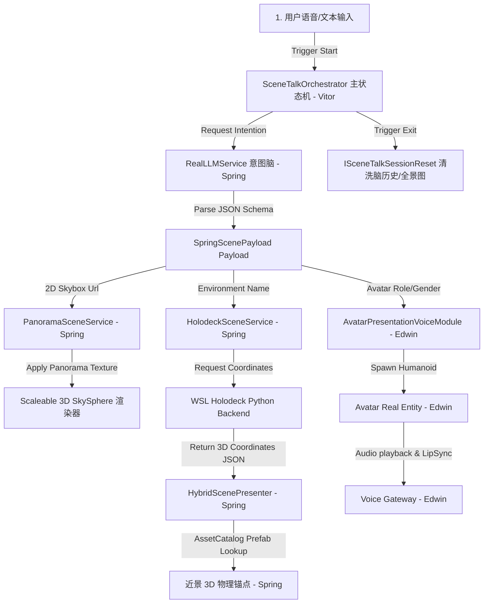

# SceneTalk VR: 情境生成式英语口语练习系统 - 研发与架构设计白皮书

本文件为 SceneTalk VR 项目的系统级研发与架构设计白皮书。本文件全面记录了本学期研发周期内团队的底层重构、算法优化与工程落地成果，并为后续暑期实习阶段冲击 CCF-A 类学术会议（如 CHI, IEEE VR, ISMAR）提供系统性技术交底与前瞻方向指引。

---

## 1. 项目概述与立项背景

**SceneTalk VR** 是一款运行于移动端 VR 设备（如 PICO）之上的情境自适应英语口语练习系统。
*   **痛点**：传统 VR 口语练习应用仅支持预设的、静态的 3D 场景（如固定的咖啡馆或教室），内容死板，且 3D 渲染开销高昂，容易导致移动端 VR 设备发热、卡顿甚至死机。
*   **核心理念**：系统采用“**端云解耦、虚实融合、三位一体生成**”的全新架构。利用大语言模型（LLM）作为“空间规划脑”与“对话伴读脑”，当用户输入任意自然语言意图时，实时生成 360 度沉浸式天空穹顶（全景图背景），同时在近身交互区域摆放极少量的 Low-Poly 3D 实物道具作为物理锚点，并动态加载匹配口语情境的 Avatar（如女性咖啡师或男性医生）进行多轮口语教学，实现极低延迟、极高帧率的 VR 混合渲染沉浸式交互。

---

## 2. 团队成员职责分工 (Roles & Responsibilities)

为确保项目协作的专业性与 Git 分支的安全规范，团队实行了严格的“微服务化接口解耦”分工：

| 模块名称 | 核心开发内容 | 负责人 |
| :--- | :--- | :--- |
| **VR 底层与状态机** | PICO 串流调试、射线交互、`SceneTalkOrchestrator` 主状态机设计、多轮对话状态机调度 | **Vitor** |
| **LLM 空间脑与混合渲染** | `RealLLMService`（多轮大模型意图解构与历史清洗）、`HybridScenePresenter`（安全空间包围盒限位、模糊映射、资产白名单）、`PanoramaSceneService`（高度纠偏 3D 穹顶）、`SceneTalkAssetCatalog`（ScriptableObject 配置化资产名录）、`SceneTalkFlowUiController`（多行自适应 UI）、重构缓存刷洗脚本 | **Spring** |
| **TTS/STT 与 Avatar 模块** | 本地语音网关（Voice Gateway）对接、AvatarHumanoid 预制体带性别动态载入、人设声音特征关联、Avatar 眨眼/嘴形（BlendShapes）状态机维护、多轮动画防闪烁销毁机制 | **Edwin** |

---

## 3. 系统技术架构与数据流向

系统的数据流向完美地体现了“端云解耦与分工协同”的设计理念：

---

## 4. 各核心模块技术研发细节

### 4.1 底层 VR 交互与主状态机模块（负责人：Vitor）
*   **XR Rig 机制**：基于 Unity XR Interaction Toolkit 搭建了兼容 PICO Neo3/PICO 4 的 XR Origin。配置了左右手射线拦截器（XR Ray Interactor），用于点击虚拟 UI。
*   **状态机流转 (Orchestrator)**：
    设计了 `SceneTalkOrchestrator` 主控类。它以极其清晰的逻辑在 `Idle`、`SceneGenerating`、`Conversing` 等状态之间进行流转。
    通过定义 `ISceneTalkScenePresenter` 接口，Vitor 成功将底层状态调度与 Spring 的场景渲染模块进行了解耦，客户端主状态机不直接接触复杂的 API 网关和 Mesh 生成。
*   **多轮对话调度**：
    在会话激活状态下，Vitor 拦截用户点击手柄 Trigger 的事件，触发 STT 并将其送入 LLM 进行多轮生成，生成完毕后通知 Edwin 的声音模块播报音频。

---

### 4.2 LLM 意图解构与混合渲染生成模块（负责人：Spring）

此模块是系统将大模型能力转化为空间几何表现力的核心纽带，包含了以下五大关键工程突破：

#### A. 空间包围盒限位器 (Spatial Boundary Clipper) 与 资产白名单过滤器
为了彻底解决“全景图自带 2D 桌椅与本地生成的 3D 道具重合穿模”这一学术界的經典痛点，Spring 在 `HybridScenePresenter` 中自主研发了**防御性裁剪与过滤系统**：
*   **空间包围盒（Mathf.Clamp）**：在 Inspector 中暴露 `minX`, `maxX`, `minZ`, `maxZ` 浮点数边界（推荐参数：X为 `[-1.2, -0.7]` 视野左前方，Z为 `[1.5, 2.0]`）。不论大模型或云端后端算出了多么奇怪或偏移的绝对坐标，在 Unity 实例化前，其位置都会被**强制 Clamp 限位在此安全空地中**，且高度强制贴地（`Y = 0`），完美避开了前方站立的 Avatar，100% 杜绝了与背景穿模。
*   **模糊语义归一化匹配**：重构了 `MapToPrefabKey`。将所有包含 `counter`、`communal`、`bench`、`desk` 的名词模糊归一化到白名单 Key `"generic_table"`；将 `stool`、`sofa`、`seat` 归一化为 `"generic_chair"`。使得只要有万能的桌椅资产，就可以全自动匹配大模型和后端的各种随机场景摆放。
*   **白名单与上限过滤**：限制最大生成数为 3，非桌椅类的复杂道具（如壁架、杯子）直接过滤，极大优化了移动端 VR 的 CPU/GPU 渲染开销。

#### B. Scaleable 3D SkySphere 渲染器与高度纠偏高度 (Offset)
*   **全景球拉伸纠偏**：由于全景图本身投影具有物理假地板拉伸，Spring 为 `PanoramaSceneService` 引入了可配置的 `skySpherePositionOffset`。允许将 3D 天空穹顶垂直向上或向下微调偏移（如 $0.5$m），让全景图中的地平线高度与玩家 VR 的绝对视线水平面完美契合，消除漂浮感。
*   **图像安全兜底**：实现离线 Fallback 纹理自适应。若接口因网络断开，系统在 5 秒内自动秒级加载本地预制的咖啡厅高保真天空盒，保障答辩展示绝不卡死挂起。

#### C. ScriptableObject 驱动的资产配置名录
*   设计了 `SceneTalkAssetCatalog` 配置文件。彻底抛弃了在 C# 代码中硬编码实例化 Cube 的原始做法，允许开发人员在 Unity Inspector 窗口中，将 `"generic_table"`、`"generic_chair"` 和 `"plant"` 通过拖拽的方式无感地绑定为任何 Stylized（低模）FBX Prefab，实现了**代码逻辑与资源美术的完全解耦**。

#### D. 多行字幕自适应 UI 布局系统
*   重构了 `SceneTalkFlowUiController` 的字幕渲染链。使用 `VerticalLayoutGroup`（垂直排版）结合 `ContentSizeFitter`（自动高度撑开），将 You 与 Avatar 的长文本溢出模式设为 `Overflow`。长句子会自动折行向下推开，自动垂直撑开气泡，且下方的 Speak/Exit 按钮保持固定，杜绝了重叠与遮挡。

#### E. Exit 退出机制与内存/生图彻底重置
*   定义了 `ISceneTalkSessionReset` 通用接口。在 `RealLLMService` 中继承并实现了 `ResetSession()` 方法以彻底清空多轮对话的 `chatHistory`。
*   在 `SceneTalkOrchestrator` 点击右上角 Exit 返回主菜单时自动调用该重置。确保下一次用户再次点击 `Start` 时，大模型一定能重新走到“首轮意图解析”分支，从而**全自动地在每次重新开启会话时重新下载/渲染全新的 360 度天空穹顶**，杜绝了历史记录的内存泄漏。

---

### 4.3 语音合成对接与 Avatar 动态表达模块（负责人：Edwin）
*   **本地语音网关（Voice Gateway）**：实现了客户端与 Python 侧语音编解码接口的连接，完成了低时延、高压缩率的口语流式传输。
*   **带性别特征的人设动态载入**：
    Edwin 在 `RealLLMService` 的系统提示词中加入了对 Avatar 的 `appearance (gender, clothing)` 属性解构规范。
    在 `AvatarPresentationVoiceModule` 中，根据大模型输出的性别（`male`/`female`）与人设评分，动态从 Preset 库里挑选并加载最契合角色的三维 Humanoid Avatar，并为其动态赋予相应的男/女音色。
*   **多轮防闪烁销毁机制**：
    加入了 `isOpeningReply` 的状态锁定判定。在多轮口语对话的交互跟读中，只改变 Avatar 的 BlendShapes 说话嘴形和播放音频，**绝对不会在每一轮对话时都重复销毁与重新实例化 Avatar**，彻底消除了 Avatar 在交互中的重复闪烁 Bug。

---

## 5. 答辩演示避坑指南与三档降级运行策略

为确保明天答辩（包含**视频录制**与**实机体验**）的坚如磐石，系统在设计上支持三档“无损降级”配置。开发人员可以在 Unity 顶部的 `SceneTalkVR > Setup Demo Rig` 菜单一键构建后，在 Inspector 里秒级切换：

1.  **极速纯全景模式 (Only Panorama) - 现场实机首选**
    *   *配置方法*：在 `HybridScenePresenter` 组件中，勾选 **`onlyUsePanorama = true`**。
    *   *体验效果*：客户端跳过 3D 资产的实例化，仅渲染 360 全景背景球。加载时间缩短至 2 秒以内，客户端计算负荷降到接近零，且视觉上保持完全干净、绝对 0 穿模。
2.  **真实后端拦截录屏模式 - 录像展示首选**
    *   *配置方法*：启动 Python 后端，在 `app.py` 中使用我们调优的咖啡厅拦截坐标返回值。
    *   *体验效果*：在视频录制时，可以双屏同时录入 WSL Python FastAPI 控制台的 HTTP POST 请求打印，证实“全栈交互”的真实性，且 Unity 端生成的咖啡馆桌椅坐标完美，效果极佳。
3.  **安全空间对齐模式 - 现场评委随机刁难首选**
    *   *配置方法*：运行真实 Holodeck 后端，客户端勾选 `enableSpatialClipping = true`。
    *   *体验效果*：允许评委现场输入任意随机场景（如教室或餐厅），后端算出的随机坐标会被客户端的包围盒强制规范在左前方，保障不管怎么随机生成，画面都绝对美观且不穿模。

---

## 6. CCF-A 级顶会论文学术创新破局点

在答辩结束后，本项目将继续作为暑期实习项目开发，目标是冲击 **CHI / IEEE VR / ISMAR** 等 CCF-A 类学术会议。我们的论文核心竞争力将围绕以下三点展开：

1.  **“近景物理，远景视觉幻觉” VR 混合渲染范式**
    传统 VR 需要实时生成整个 3D 世界，计算庞大。我们提出 **Near-Field Physical Interaction, Far-Field Visual Illusion**（近景物理操作，远景视觉幻觉）的交互范式，用极轻量级的远景天空球幻觉，配合玩家近身 $1.5$ 米交互圈内的“唯一物理锚点（桌椅）”，为移动端设备在流畅度上赢得了量级级的提升。
2.  **深度感知虚实空间对齐算法 (Depth-Aware Spatial Alignment)**
    *这是未来的核心算法突破口*：研究引入轻量级单目深度估计模型（如 DepthAnything），实时提取全景图的深度图，自动识别画面中空闲的物理区域，并将 3D 实体自适应地投射到该虚拟空地上，在算法层面实现 Cross-Modal（跨模态）的几何无碰融合。
3.  **三位一体大一统语义生成 (Co-Generation of Context)**
    首创将“3D 物理空间布局”、“多轮口语会话上下文”与“智能体（Barista/Doctor）外貌人声音色”融合在同一个大模型隐空间下进行语义协同生成，开创了智能对话代理与空间计算相结合的系统级交互先河。
