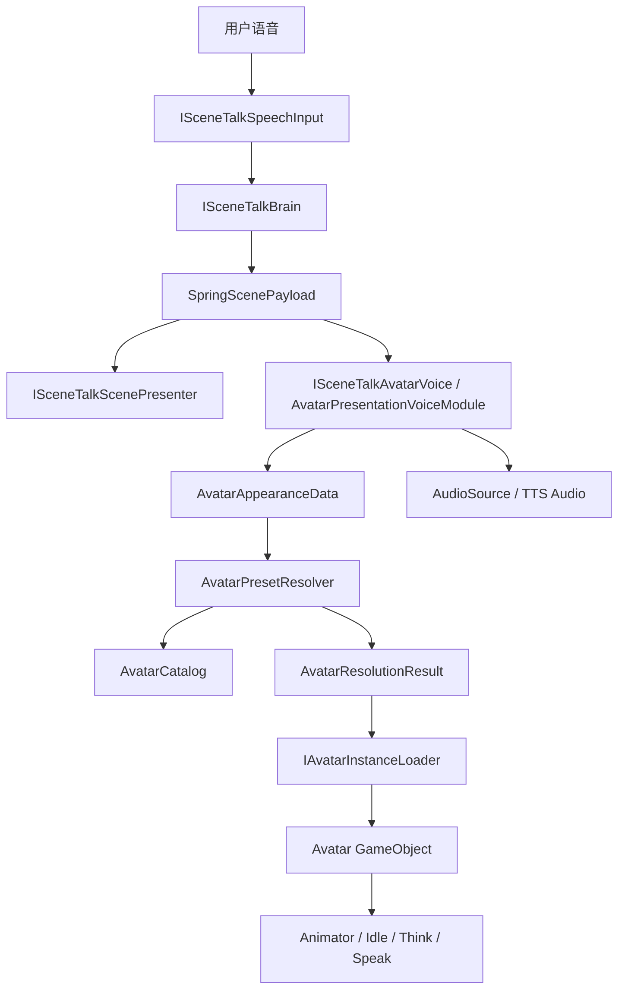

# SceneTalkVR Avatar 外观生成模块技术规划

## 1. 文档目标

本文档用于指导当前阶段如何在 SceneTalkVR 中实现“基于 LLM 描述的 Avatar 外观生成”。这里的“生成”不等同于运行时从文本生成全新 3D 人体网格，而是指：

```text
LLM 角色描述 -> 结构化 Avatar 配置 -> 本地/远程 Avatar 资源匹配 -> Unity 运行时加载与呈现
```

当前阶段的核心目标是先把 Avatar 外观能力做成一个解耦、模块化、可替换、可复用的 Unity 子系统。系统应允许先用占位 Prefab 和本地预设库跑通，再逐步替换为真实模型、Addressables、Ready Player Me、UMA 或其他 Avatar 后端。

## 2. 当前项目基础

当前 Unity 客户端位于 `Client`，已有以下基础：

- `SceneTalkOrchestrator`：负责练习流程状态机，串联语音输入、LLM/场景生成、场景呈现和 Avatar 回复。
- `SceneTalkContracts`：定义模块接口与跨模块数据结构。
- `DemoSpeechInputModule`、`DemoBrainModule`、`DemoAvatarVoiceModule`：用于假数据闭环。
- `SceneTalkScenePresenter`：消费场景 payload 并生成本地场景物体。

因此 Avatar 模块不应该绕开现有主流程单独实现，而应该作为 `SceneTalkOrchestrator` 的一个可替换下游模块接入。

当前仓库中尚未包含真实 humanoid Avatar 资源库。第一阶段已经先建立本地 Avatar 预设库目录和数据登记方式，并使用 primitive 组合出的占位 Prefab 跑通 P0 链路；后续可逐步替换为真实模型。

## 2.1 当前实现状态（2026-06-06）

已完成 P0 主链路：

- 已在 `SceneTalkContracts.cs` 中扩展 `AvatarAppearanceData`，并挂到 `AvatarRoleData.appearance`。
- 已新增 `AvatarCatalog`、`AvatarPresetEntry`、`AvatarResolutionResult`、`AvatarPresetResolver`。
- 已新增 `IAvatarInstanceLoader` 与 `PrefabAvatarInstanceLoader`。
- 已新增 `AvatarPresentationVoiceModule`，作为 `ISceneTalkAvatarVoice` 的组合实现，内部串联 resolver、loader、Avatar 实例替换和 demo 语音播放。
- 已新增 `SceneTalkVR/Avatar/Generate Placeholder Avatars` 编辑器菜单，可生成占位 Avatar 资源。
- 已生成 `barista_default`、`teacher_default`、`police_default` 三个占位 Avatar prefab。
- 已生成 `AvatarCatalog.asset`，并登记上述三个占位角色的 role、environment、outfit、accessory、must-have 等匹配标签。
- 已更新 `SceneTalkVR/Setup/Rebuild Demo Rig`，自动挂载 `AvatarPresetResolver`、`PrefabAvatarInstanceLoader`、`AvatarPresentationVoiceModule`，并把 catalog 赋给 resolver。
- 已在 Play Mode 中验证 `Start Practice` 后 `barista_default` 会根据 demo payload 自动加载出来。
- 已更新 `DemoBrainModule`，可根据输入关键词生成 barista / teacher / police 三类 demo payload，并已验证会分别命中对应 Avatar key。
- 已验证未知角色 fallback、旧 Avatar 清理、多轮替换、Avatar 资源缺失时继续流程等 P0 稳定性项。

当前仍未完成：

- 还未实现真实 humanoid 模型、Animator Controller、口型同步或 Addressables 加载。
- UI 中 `Retry` 按钮目前只在 Error 状态有实际作用，后续应改为仅 Error 时启用或显示。

## 3. 总体设计原则

### 3.1 解耦

Avatar 外观模块不直接依赖具体 LLM、TTS、STT 或场景生成服务。它只消费统一的 Avatar 配置数据，例如角色职业、年龄段、发型、服装、配件、风格和 seed。

模块之间的数据边界应保持如下关系：

```text
Speech/STT -> LLM Brain -> SpringScenePayload -> Avatar Resolver -> Avatar Loader -> Avatar Presenter
```

LLM Brain 只负责产出描述和结构化字段；Avatar 模块只负责根据结构化字段匹配、加载和呈现角色。

### 3.2 模块化

Avatar 子系统拆成若干小模块，而不是做成一个大脚本：

- `AvatarAppearanceData`：描述 Avatar 外观意图的数据结构。
- `AvatarCatalog`：本地可用 Avatar 资源目录。
- `AvatarPresetEntry`：单个 Avatar 预设条目。
- `AvatarPresetResolver`：把外观意图匹配到具体资源 key。
- `IAvatarInstanceLoader`：加载 Avatar 实例的抽象接口。
- `PrefabAvatarInstanceLoader`：第一阶段使用的本地 Prefab 加载器。
- `AvatarPresentationVoiceModule`：挂到场景中的运行时呈现模块，当前同时负责 Avatar 呈现和 demo 语音播放。

后续如需接入 Addressables、Ready Player Me 或 UMA，只替换 loader/resolver，不改主状态机。

### 3.3 可复用

Avatar 模块应该能被不同场景、不同对话任务复用。不要把“咖啡店员”“老师”“警官”等逻辑写死在 UI 或流程脚本里，而应通过 catalog 数据登记。

一个 Avatar 预设可以被多个任务复用。例如：

- `barista_default` 可用于咖啡店点单、兼职面试、旅游问路。
- `teacher_default` 可用于课堂练习、考试反馈、校园咨询。
- `police_default` 可用于问路、报案、机场安检。

### 3.4 可降级

Avatar 模块必须允许字段缺失、资源缺失、网络失败和模型加载失败。任何失败都不应该中断整条口语练习流程。

推荐降级顺序：

```text
精确匹配 -> 同职业近似匹配 -> 同场景默认角色 -> 全局默认角色 -> 占位 Avatar
```

### 3.5 移动端优先

目标设备包含 PICO 4，因此第一阶段不追求影视级角色。模型导入和运行时加载要优先考虑：

- 低 draw call。
- 合理贴图尺寸。
- Humanoid 动画兼容。
- 可控 LOD。
- 可本地缓存。
- 可在网络不可用时演示。

## 4. 阶段目标

### 4.1 P0：本地预设库与假数据闭环

目标：不依赖真实 LLM、不依赖真实 Avatar 平台，先让客户端能根据 payload 切换 Avatar。

需要完成：

- 扩展 `SpringScenePayload.avatarRole`，增加 `appearance` 字段。
- 新增 Avatar 外观数据结构。
- 新建本地 Avatar 预设库目录。
- 新建 `AvatarCatalog` 数据资产。
- 新建 resolver，根据外观字段返回 `avatarPrefabKey`。
- 新建本地 Prefab loader，负责实例化 Avatar。
- 将现有 demo payload 改成至少 3 个角色样例。
- 在 Editor 内验证“不同用户指令 -> 不同 Avatar 外观”。

P0 阶段的 Avatar 可以是简单占位角色，例如 capsule、人形 primitive、低模模型或临时下载模型。重点不是美术质量，而是架构和链路正确。

### 4.2 P1：真实模型替换与 Humanoid 动画兼容

目标：把占位 Avatar 替换成可演示的真实模型，并保持统一加载接口。

需要完成：

- 找到或制作 3-5 个代表性角色模型。
- 导入 Unity 后统一设置 Rig 为 Humanoid。
- 为每个角色制作 Prefab。
- 统一 Animator Controller 或最小动作状态。
- 把真实 Prefab 登记进 `AvatarCatalog`。
- 验证模型能复用 speaking/thinking/idle 动画。

推荐优先覆盖角色：

- `teacher_default`
- `barista_default`
- `police_default`
- `student_default`
- `tourist_default`

P1 资源准入标准：

- 授权明确：模型来源、使用许可和是否允许课程/论文/demo 展示必须可追溯。
- Unity 可导入：优先 FBX、GLB、Blend 等 Unity 可稳定导入格式。
- Humanoid 可用：Rig 能配置为 Humanoid，骨骼映射无关键缺失。
- 移动端可承受：面数、材质数量、贴图尺寸不过度；PICO 4 上应优先低到中等复杂度。
- 材质稳定：不要依赖复杂自定义 shader；优先 URP Lit 或标准 PBR 子集。
- 动画可复用：至少能挂基础 idle / thinking / speaking 动作，或能先以无动画静态角色进入链路。
- Prefab 可治理：导入后必须制作正式 Prefab，并通过 `AvatarCatalog.asset` 登记，不允许运行时代码硬编码模型路径。

P1 试点流程：

1. 先选 1 个真实角色模型，建议从 `barista` 或 `teacher` 开始。
2. 放入临时导入目录，完成授权和资源体量检查。
3. 在 Unity Import Settings 中配置 Rig 为 Humanoid。
4. 制作 `*_humanoid_v1` Prefab，调整缩放、朝向、材质和根节点位置。
5. 在 `AvatarCatalog.asset` 中新增真实模型条目，保留原占位 prefab 作为 fallback。
6. Play Mode 验证同一 transcript 可以加载真实模型，并确认失败时仍可回退占位模型。

### 4.3 P2：Addressables 与资源治理

目标：从 Inspector 直接引用 Prefab 升级到可打包、可远程分发、可缓存的资源加载方式。

需要完成：

- 为 Avatar prefab 配置 Addressables key。
- 新增 `AddressablesAvatarInstanceLoader`。
- 支持异步加载、超时、错误回调。
- 对移动端 Avatar 资源做分组。
- 设计本地常用角色和远程长尾角色的加载策略。
- 记录加载耗时、失败率和 fallback 原因。

### 4.4 P3：生成增强层

目标：只在稳定预设库基础上增加生成式能力，不把 3D 人体生成放进 runtime 主链。

可选方向：

- 服装图案贴花生成。
- 工牌、logo、徽章生成。
- 皮肤细节、妆容、胡须等轻量纹理变体。
- 少量配件离线生成后入库。

P3 不应影响 P0-P2 的稳定链路。生成失败时直接回退到预设材质或默认配件。

## 5. 推荐目录结构

建议在 `Client/Assets/SceneTalkVR` 下增加以下目录：

```text
Client/Assets/SceneTalkVR/
  Avatar/
    Catalogs/
      AvatarCatalog.asset
    Prefabs/
      Placeholder/
      Humanoid/
    Materials/
    Animations/
    Scripts/
      AvatarAppearanceData.cs
      AvatarCatalog.cs
      AvatarPresetEntry.cs
      AvatarPresetResolver.cs
      IAvatarInstanceLoader.cs
      PrefabAvatarInstanceLoader.cs
      AvatarPresentationVoiceModule.cs
```

如果后续接入 Addressables，可继续增加：

```text
Client/Assets/SceneTalkVR/Avatar/Scripts/
  AddressablesAvatarInstanceLoader.cs
```

## 6. 数据协议设计

### 6.1 扩展后的 payload

建议在现有 `AvatarRoleData` 下增加 `appearance`：

```json
{
  "taskType": "ordering_coffee",
  "environmentType": "coffee_shop",
  "dialogueReply": "Good morning! What can I get for you today?",
  "avatarRole": {
    "role": "barista",
    "speakingSpeed": "fast",
    "accent": "american",
    "attitude": "friendly",
    "appearance": {
      "styleId": "semi_realistic_v1",
      "genderPresentation": "female",
      "ageBucket": "young_adult",
      "bodyBuild": "average",
      "hairStyle": "short_curly",
      "hairColor": "black",
      "outfitRole": "barista",
      "outfitColor": "green",
      "accessories": ["round_black_glasses"],
      "mustHave": ["green_apron"],
      "mustNotHave": [],
      "unsupported": [],
      "seed": 12345
    }
  }
}
```

字段设计原则：

- 优先使用枚举，不使用大段自然语言。
- 每个字段允许为空。
- 不支持的需求写入 `unsupported`，例如真实人物相似度。
- `seed` 用于后续确定性选择，不要求第一阶段完整实现。

### 6.2 Catalog 条目

每个 Avatar 预设需要描述它能满足哪些外观条件：

```json
{
  "key": "barista_green_apron",
  "displayName": "Barista - Green Apron",
  "roles": ["barista", "clerk"],
  "environmentTags": ["coffee_shop", "restaurant"],
  "genderPresentation": "female",
  "ageBuckets": ["young_adult", "adult"],
  "outfitTags": ["barista", "green_apron"],
  "accessoryTags": ["glasses"],
  "qualityTier": "placeholder",
  "mobileReady": true
}
```

Unity 内可以用 `ScriptableObject` 表示 catalog，而不是运行时解析散落 JSON。这样方便 Inspector 编辑，也方便后续资源引用。

## 7. 代码设计

### 7.1 数据类

建议新增：

- `AvatarAppearanceData`
- `AvatarResolutionResult`
- `AvatarPresetEntry`
- `AvatarCatalog`

`AvatarResolutionResult` 至少包含：

- `avatarKey`
- `fallbackLevel`
- `fallbackReason`
- `score`
- `preset`

这样 UI、日志和测试可以知道系统为什么选择某个角色。

### 7.2 Resolver

Resolver 负责把外观意图转换成具体资源。第一阶段可以使用简单打分：

```text
role 命中 +40
environment 命中 +20
outfit 命中 +20
accessory 命中 +10
age/gender/style 命中 +10
mobileReady +5
```

如果最高分低于阈值，进入 fallback：

```text
按 role 找默认 -> 按 environment 找默认 -> global_default
```

Resolver 不负责实例化 GameObject。它只返回资源选择结果。

### 7.3 Loader

Loader 负责根据 resolver 的结果加载 Avatar 实例。

第一阶段接口可以设计为：

```csharp
public interface IAvatarInstanceLoader
{
    IEnumerator LoadAvatar(
        AvatarResolutionResult resolution,
        Transform parent,
        Action<GameObject> onComplete,
        Action<string> onError);
}
```

实现类：

- `PrefabAvatarInstanceLoader`：从 catalog 中的 prefab 引用直接实例化。
- `AddressablesAvatarInstanceLoader`：后续从 Addressables key 异步加载。
- `RemoteAvatarInstanceLoader`：后续可接 Ready Player Me 或其他远程服务。

### 7.4 Presenter

`AvatarPresentationVoiceModule` 负责把加载出的 Avatar 放到场景中，并与语音/动画连接。

职责包括：

- 清理上一轮 Avatar。
- 调用 resolver。
- 调用 loader。
- 设置位置、朝向和缩放。
- 绑定 Animator。
- 触发 idle/thinking/speaking 动画。
- 向现有 voice module 提供当前 Avatar 的 Animator 或 AudioSource。

不建议让 `SceneTalkOrchestrator` 直接管理 Avatar prefab。Orchestrator 只关心状态流转。

### 7.5 与现有接口的接入方式

当前已有 `ISceneTalkAvatarVoice.PresentReply(...)`。短期可以有两种接入方式：

方案 A：扩展现有 `DemoAvatarVoiceModule`

- 优点：改动少，最快跑通。
- 缺点：语音播放和 Avatar 加载混在一起，后续拆分成本略高。

方案 B：新增 Avatar presentation 模块，并让 voice module 只负责音频

- 优点：更干净，符合解耦目标。
- 缺点：需要对 orchestrator 或接口稍作扩展。

当前推荐先采用折中方案：

- 保留 `ISceneTalkAvatarVoice`，新增一个实现类 `AvatarPresentationVoiceModule`。
- 它内部组合 resolver、loader、AudioSource、Animator。
- 等真实 STT/TTS 接入稳定后，再把语音播放和 Avatar 呈现拆成两个更细接口。

## 8. 架构示意



## 9. 当前阶段任务清单

### 9.1 架构设计任务

- [x] 明确 Avatar 模块边界：只消费 payload，不直接调用 LLM。
- [x] 确定 P0 阶段使用本地 Prefab 预设库，不接实时 text-to-3D。
- [x] 确定 fallback 规则和默认角色。
- [x] 确定 Avatar 资源目录、命名规范和 catalog 字段。
- [x] 确定后续 Addressables 替换点。

### 9.2 代码设计任务

- [x] 在 `SceneTalkContracts.cs` 中增加 `AvatarAppearanceData`。
- [x] 扩展 `AvatarRoleData`，加入 `appearance`。
- [x] 新增 `AvatarPresetEntry`、`AvatarCatalog`。
- [x] 新增 `AvatarResolutionResult`。
- [x] 新增 `AvatarPresetResolver`。
- [x] 新增 `IAvatarInstanceLoader`。
- [x] 新增 `PrefabAvatarInstanceLoader`。
- [x] 新增 `AvatarPresentationVoiceModule`。
- [x] 修改 `DemoBrainModule`，输出多种角色样例。
- [x] 更新 demo setup menu，让新模块能挂进 Demo Rig。

### 9.3 资源设计任务

- [x] 建立 `Client/Assets/SceneTalkVR/Avatar/Prefabs/Placeholder`。
- [x] 制作至少 3 个占位 Avatar：
  - `teacher_default`
  - `barista_default`
  - `police_default`
- [x] 为占位 Avatar 配置不同颜色、简单配件或职业标识。
- [x] 建立 `AvatarCatalog.asset`。
- [x] 为每个 Avatar 登记 role、environment、outfit、accessory tags。

### 9.4 验证任务

- [x] Editor Play Mode 下切换 3 个不同 payload：已用 resolver 验证 barista / teacher / police 分别命中对应 key。
- [x] 验证未知角色会回退到默认 Avatar。
- [x] 验证 Avatar 切换时旧实例会被清理。
- [x] 验证 speaking/thinking 动画触发不报错。
- [x] 验证没有 Avatar 资源时，流程仍能播放回复或进入可恢复错误。
- [x] 记录一次 demo 运行路径：Play Mode 点击 `Start Practice` 后，demo payload 成功解析并实例化 `barista_default`。

## 10. 验收标准

P0 阶段完成时，应满足：

- 输入不同 `avatarRole.appearance` 后，场景中能出现不同 Avatar。
- resolver 有明确日志，说明命中或 fallback 原因。
- Avatar 资源缺失不会导致主流程崩溃。
- 新增代码不把资源选择逻辑写死在 orchestrator。
- 至少 3 个角色样例可在 Demo 中稳定重复。
- 现有假数据闭环仍可运行。

P1 阶段完成时，应满足：

- 至少 3 个真实 humanoid 角色可替换占位角色。
- 每个角色能复用同一套基础 idle/thinking/speaking 动画。
- 角色模型在移动端预算内，没有明显超大贴图或异常材质数量。
- 角色 prefab 可通过 catalog 统一管理。

## 11. 风险与控制

### 11.1 资源质量风险

不同来源模型的骨骼、比例、材质和贴图差异很大。不要把外部模型直接当成稳定库使用。

控制方式：

- 每个模型先进入 `Incoming` 或临时目录。
- 检查授权、面数、贴图、Rig、材质数量。
- 通过后再制作正式 Prefab。

### 11.2 Humanoid 动画不兼容

部分模型即使看起来是人形，也未必能正确转 Unity Humanoid。

控制方式：

- P1 只选择能稳定配置 Humanoid 的模型。
- 动画先使用最小 idle/thinking/speaking。
- 不在第一阶段做复杂口型同步和面部表情。

### 11.3 过早接入复杂 Avatar 平台

Ready Player Me、UMA、MetaHuman 等方案各有生态约束。如果太早接入，会拖慢主链路验证。

控制方式：

- P0 只做本地 Prefab。
- P1 替换真实模型。
- P2 再评估 Addressables 或外部平台。

### 11.4 LLM 输出不稳定

LLM 可能输出不存在的字段、拼写错误或不支持的角色。

控制方式：

- 使用严格 JSON schema。
- Unity 侧做合法化和 fallback。
- Resolver 不信任自由文本，只信任枚举和白名单。

## 12. 后续扩展方向

当 P0/P1 稳定后，可以逐步加入：

- Addressables 远程角色包。
- Avatar 加载缓存。
- Avatar LOD。
- 贴花/纹理生成。
- 简易口型同步。
- 真实 TTS 音频驱动的 speaking 动画。
- 多角色同屏。
- 角色风格包，例如 semi-realistic、cartoon、low-poly。

这些扩展必须保持在现有 resolver/loader/presenter 边界内，不应反向污染 `SceneTalkOrchestrator`。

## 13. 推荐下一步

P0 已完成，下一步进入 P1：真实 humanoid 模型替换试点。

建议先做单模型试点，而不是一次替换所有角色：

1. 找 1 个授权清晰、Unity 可导入、移动端体量适中的真实 humanoid 模型。
2. 优先替换 `barista_default` 或新增 `barista_humanoid_v1`。
3. 完成 Humanoid Rig 配置、Prefab 制作、材质检查和 `AvatarCatalog.asset` 登记。
4. Play Mode 验证真实模型加载成功，并保留原占位模型作为 fallback。
5. 单模型流程稳定后，再扩展到 teacher / police / student / tourist。
