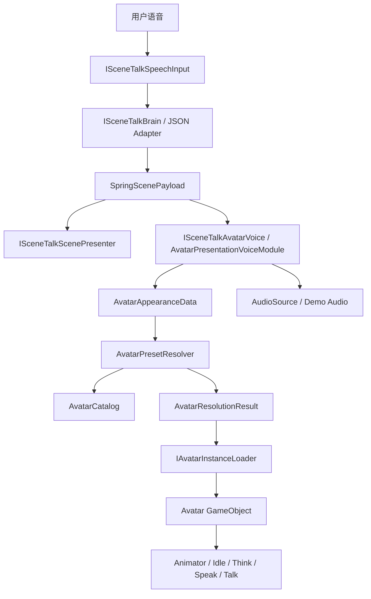

# SceneTalkVR Avatar 外观生成模块技术规划

## 1. 文档目标

本文档用于指导 Edwin 负责的 SceneTalkVR Avatar 子模块实现。这里的“Avatar 外观生成”不等同于 Edwin 负责运行时从用户自然语言识别角色、调用 LLM 或生成全新 3D 人体网格，而是指：

```text
收到结构化 SpringScenePayload JSON -> 读取 Avatar 配置 -> 本地/远程 Avatar 资源匹配 -> Unity 运行时加载与呈现
```

当前阶段的核心目标是先把 Edwin 负责的 Avatar 消费端做成一个解耦、模块化、可替换、可复用的 Unity 子系统。系统应允许先用占位 Prefab 和本地预设库跑通，再逐步替换为真实模型、Addressables、Ready Player Me、UMA 或其他 Avatar 后端。

## 2. 当前项目基础

当前 Unity 客户端位于 `Client`，已有以下基础：

- `SceneTalkOrchestrator`：负责练习流程状态机，串联语音输入、LLM/场景生成、场景呈现和 Avatar 回复。
- `SceneTalkContracts`：定义模块接口与跨模块数据结构。
- `DemoSpeechInputModule`、`DemoBrainModule`、`DemoAvatarVoiceModule`：用于假数据闭环。
- `SceneTalkScenePresenter`：消费场景 payload 并生成本地场景物体。

因此 Avatar 模块不应该绕开现有主流程单独实现，而应该作为 `SceneTalkOrchestrator` 的一个可替换下游模块接入。

当前仓库中尚未包含真实 humanoid Avatar 资源库。第一阶段已经先建立本地 Avatar 预设库目录和数据登记方式，并使用 primitive 组合出的占位 Prefab 跑通 P0 链路；后续可逐步替换为真实模型。

## 2.1 Edwin 分工边界

根据 `conversation.md` 中的项目分工，Spring 侧负责 LLM 大脑与场景生成，包括用户指令解析、Prompt Engineering、对话记忆、场景 JSON 或全景图生成；Edwin 侧原始分工覆盖语音交互与 Avatar 系统。当前本文档只收敛 Edwin 的 Avatar 部分，尤其是“收到结构化 JSON 后”的 Unity 处理链路。

Edwin 当前负责：

- 定义并维护 Avatar 侧消费的数据结构，例如 `AvatarRoleData.appearance`。
- 根据已收到的 `SpringScenePayload` 选择合适 Avatar 资源。
- 维护本地 Avatar catalog、角色 prefab、资源标签、fallback 规则。
- 实现 Avatar resolver、loader、presenter 等 Unity 运行时模块。
- 导入真实 humanoid 模型，制作 prefab，并登记到 `AvatarCatalog.asset`。
- 保证 Avatar 缺失、字段缺失或匹配失败时主练习流程仍可继续。

Edwin 当前不负责：

- 用户自然语言意图识别。
- LLM API 调用、Prompt 设计、上下文记忆和多轮对话策略。
- 将用户输入转换成 JSON 的 schema enforcement 或云端解析逻辑。
- 场景生成、Holodeck 后端、360 skybox API 或环境布局生成。
- 真实 TTS/STT 服务选型与接入，除非后续团队重新调整分工。

因此与 LLM/场景同学的协作接口应保持为：对方产出稳定的 `SpringScenePayload` JSON，Edwin 的 Avatar 模块只消费其中 `environmentType`、`avatarRole`、`avatarRole.appearance` 等字段，并在 Unity 侧做容错和资源降级。

## 2.2 当前实现状态（2026-06-09）

已完成 P0 主链路：

- 已在 `SceneTalkContracts.cs` 中扩展 `AvatarAppearanceData`，并挂到 `AvatarRoleData.appearance`。
- 已新增 `AvatarCatalog`、`AvatarPresetEntry`、`AvatarResolutionResult`、`AvatarPresetResolver`。
- 已新增 `IAvatarInstanceLoader` 与 `PrefabAvatarInstanceLoader`。
- 已新增 `AvatarPresentationVoiceModule`，作为 `ISceneTalkAvatarVoice` 的组合实现，内部串联 resolver、loader、Avatar 实例替换和 demo 语音播放。
- 已新增 `SceneTalkVR/Avatar/Generate Placeholder Avatars` 编辑器菜单，可生成占位 Avatar 资源。
- 已生成 `barista_default`、`teacher_default`、`police_default` 三个占位 Avatar prefab。
- 已生成 `AvatarCatalog.asset`，并登记上述三个占位角色的 role、environment、outfit、accessory、must-have 等匹配标签。
- 已更新 `SceneTalkVR/Setup/Rebuild Demo Rig`，自动挂载 `AvatarPresetResolver`、`PrefabAvatarInstanceLoader`、`AvatarPresentationVoiceModule`，并把 catalog 赋给 resolver。
- 已在 Play Mode 中验证 `Start Practice` 后 `barista_default` 会根据 demo payload 自动加载出来。
- 已更新 `DemoBrainModule`，可根据输入关键词生成 barista / teacher / police 三类 demo payload，并已验证会分别命中对应 Avatar key。
- 已验证未知角色 fallback、旧 Avatar 清理、多轮替换、Avatar 资源缺失时继续流程等 P0 稳定性项。

P1 已完成增量（2026-06-10）：

- 已接入一个真实 Humanoid 角色 `teacher_humanoid_v1`，使用 Quaternius / Poly Pizza 授权为 CC0 的 `Business Man` 模型。
- 已建立真实角色导入目录、授权记录、模型体量记录和 prefab 制作脚本。
- 已配置 `AvatarCommonHumanoid.controller`，提供统一 `Idle` / `Think` / `Speak` / `Talk` 动作协议；`Speak` 保留首次开场挥手，`Talk` 使用 head-only mask 后的外部 `Rig|Idle_Talking_Loop` 作为后续对话微动作。
- 已新增 `AvatarAnimationDriver`，让不同 Humanoid 角色外观复用同一套动作触发层。
- 已新增 `AvatarPropCatalog.asset`、`book_prop_v1.prefab`、`AvatarPropPresenter` 和 `AvatarAttachmentSockets`，把角色外观与职业道具素材解耦。
- 已将 teacher 的 book 从角色 prefab 内移出，保留为可选运行时 prop，不再默认随人物生成。
- 已接入第二个真实 Humanoid 角色 `barista_humanoid_v1`，使用 Quaternius / Poly Pizza 授权为 CC0 的 `Animated Woman` 模型。
- 已接入第三个真实 Humanoid 角色 `police_humanoid_v1`，使用 Quaternius / Poly Pizza 授权为 CC0 的 `SWAT` 模型。
- 已接入 `frappe_prop_v1`，使用 Kenney / Poly Pizza 授权为 CC0 的 `Frappe` OBJ 模型；当前默认演示不再随人物挂载 props。
- 已在 `AvatarPropPresenter` 中补偿 Humanoid 骨骼挂点的 parent scale，避免道具因导入骨骼缩放被放大或偏移。
- 已验证 teacher fixed payload 能加载真实模型、触发共享动作，并能在资源缺失时回退 placeholder。
- 已验证 barista fixed payload 能加载真实模型、触发共享动作，并能在资源缺失时回退 placeholder。
- 已验证 police fixed payload 能加载 `police_humanoid_v1`，Humanoid Avatar 为 `isValid=True` / `isHuman=True`，并继续保留 `police_default` fallback。

P1 调整与验证（2026-06-11）：

- 已将 Demo Rig 的 `AvatarRoot` 默认缩放从 `0.8` 调整为 `1.25`，让真实 Humanoid 角色在当前相机/桌面场景中更易读。
- 已微调 `frappe_prop_v1` 的右手 socket 偏移、旋转和缩放，使它贴近 barista 右手；Play Mode 验证中 frappe 与右手距离约 `0.021m`。
- 2026-06-17 调整：人物生成默认不再挂载 props，Demo Rig 不再默认添加 `AvatarPropPresenter`；`AvatarPresentationVoiceModule.attachProps` 默认为关闭，仅保留未来重新启用的开关。
- Play Mode 固定 coffee-shop payload 验证：`barista_humanoid_v1` 加载成功，角色外观链路正常；默认不生成 `frappe_prop_v1`。

与 Vitor 多轮交互框架集成（2026-06-29）：

- 已合入 Vitor 的 `SceneTalkOrchestrator.IsDialogueActive` / `StartDialogueTurn()` 框架；初始场景和 Avatar 生成后，后续每一轮对话会继续调用 `ISceneTalkAvatarVoice.PresentReply(...)`。
- `AvatarPresentationVoiceModule` 已保留 Vitor 的 `currentAvatarKey` 复用逻辑：连续回合中如果 resolver 命中同一个 Avatar key，不重复销毁和重新加载角色，只刷新道具状态并继续播放回复。
- 初始回复会通过 `ISceneTalkAvatarReplyContext.SetReplyContext(true)` 保持 `Speak` 挥手动作；同场景后续回复会通过 `SetReplyContext(false)` 触发 `Talk` talking loop，避免 Avatar 每句话都挥手。
- `Talk` 使用 Quaternius `Animated Base Character` 的 `Rig|Idle_Talking_Loop`，但只通过 `AvatarTalkGesture.mask` 作用在头部；body/root/legs/arms/fingers 保持基础 idle，避免 full-body retarget 和手臂姿态造成角色变形或怪异 pose。
- 已更新 `SceneTalkVR/Setup/Rebuild Demo Rig With Voice Gateway`，在不重建场景的情况下也会重新绑定 `AvatarPresentationVoiceModule.defaultAnimatorController` 和 `AvatarAnimationDriver`，避免已有 rig 中 Avatar 不播放动作。
- `AvatarPresentationVoiceModule.attachProps` 仍作为默认关闭的道具开关；无论新加载 Avatar 还是复用当前 Avatar，都会先清理 props，并且只有显式启用 `attachProps` 时才重新挂载 props。
- Edwin 的 Avatar 侧支持“连续回合中的 Avatar 复用和回复呈现”，但不负责 LLM 对话记忆、角色连续性策略或 Prompt。若后续回合需要保持同一角色语义，应由 Spring 的 Brain 在 payload 中稳定输出对应 `avatarRole` / `appearance` 字段。

后续仍未完成：

- 若后续课程/demo 需要更多场景覆盖，可继续接入 `student_humanoid_v1` 或 `tourist_humanoid_v1`，但这不再阻塞 Avatar P1。
- props 当前不是演示重点，默认关闭；若后续重新需要道具，再通过 `AvatarPresentationVoiceModule.attachProps` 和 `AvatarPropPresenter` 显式启用。
- 还未实现 Addressables 加载；这属于 P2，不是 P1 的必要前置。
- 口型同步属于后续增强项，不阻塞 P1 真实模型替换。
- UI 中 `Retry` 按钮目前只在 Error 状态有实际作用，但用户已确认这不是当前重点。

## 3. 总体设计原则

### 3.1 解耦

Avatar 外观模块不直接依赖具体 LLM、TTS、STT 或场景生成服务。它只消费统一的 Avatar 配置数据，例如角色职业、年龄段、发型、服装、配件、风格和 seed。

模块之间的数据边界应保持如下关系：

```text
Speech/STT -> LLM Brain -> SpringScenePayload -> Avatar Resolver -> Avatar Loader -> Avatar Presenter
```

LLM Brain 或 JSON adapter 只负责产出 `SpringScenePayload`；Avatar 模块只负责根据结构化字段匹配、加载和呈现角色。Edwin 的代码不应反向依赖 LLM prompt、LLM provider、JSON 生成细节或用户意图识别规则。

### 3.2 模块化

Avatar 子系统拆成若干小模块，而不是做成一个大脚本：

- `AvatarAppearanceData`：描述 Avatar 外观意图的数据结构。
- `AvatarCatalog`：本地可用 Avatar 资源目录。
- `AvatarPresetEntry`：单个 Avatar 预设条目。
- `AvatarPresetResolver`：把外观意图匹配到具体资源 key。
- `IAvatarInstanceLoader`：加载 Avatar 实例的抽象接口。
- `PrefabAvatarInstanceLoader`：第一阶段使用的本地 Prefab 加载器。
- `AvatarPresentationVoiceModule`：挂到场景中的运行时呈现模块，当前同时负责 Avatar 呈现和 demo 语音播放。
- `AvatarAnimationDriver`：统一触发 Humanoid `Idle` / `Think` / `Speak` / `Talk` 动作协议。
- `AvatarPropCatalog`：登记可复用道具资源，例如 book、coffee cup、tray、pointer。
- `AvatarPropPresenter`：根据 `SpringScenePayload`、角色 role 和 appearance accessories 给当前 Avatar 挂载道具。
- `AvatarAttachmentSockets`：为角色提供 `LeftHand`、`RightHand`、`Chest`、`Head` 等挂点，优先使用 Humanoid 骨骼。

后续如需接入 Addressables、Ready Player Me 或 UMA，只替换 loader/resolver，不改主状态机。

### 3.2.1 角色与道具解耦

P1 起，角色 prefab 不应把职业道具硬编码为自身子物体。角色 prefab 只负责“人”的外观、Humanoid Rig、统一 Animator Controller 和可选挂点；道具 prefab 作为独立资源进入 `AvatarPropCatalog.asset`。

推荐组合关系如下：

```text
AvatarCatalog        -> 选择角色外观，例如 teacher_humanoid_v1 / barista_humanoid_v1
AvatarPropCatalog    -> 选择道具素材，例如 book_prop_v1 / coffee_cup_prop_v1
AvatarAttachmentSockets -> 决定道具挂到 LeftHand / RightHand / Chest / World 等位置
AvatarPropPresenter  -> 运行时根据 payload 把角色和道具组合起来
```

这样后续可以自由组合：

```text
teacher_humanoid_v1 + book_prop_v1
teacher_humanoid_v1 + coffee_cup_prop_v1
barista_humanoid_v1 + book_prop_v1
barista_humanoid_v1 + coffee_cup_prop_v1
```

当具体道具素材尚未确定时，允许先用低成本本地 prefab 或现成 CC0 道具占位；但这些道具仍必须通过 `AvatarPropCatalog.asset` 登记和运行时挂载，而不是写死进角色 prefab 或加载脚本。

### 3.3 可复用

Avatar 模块应该能被不同场景、不同对话任务复用。不要把“咖啡店员”“老师”“警官”等逻辑写死在 UI 或流程脚本里，而应通过 catalog 数据登记。

一个 Avatar 预设可以被多个任务复用。例如：

- `barista_default` 可用于咖啡店点单、兼职面试、旅游问路。
- `teacher_default` 可用于课堂练习、考试反馈、校园咨询。
- `police_default` 可用于问路、报案、机场安检。

### 3.4 可降级

Avatar 模块必须允许字段缺失、资源缺失、网络失败和模型加载失败。任何失败都不应该中断整条口语练习流程。

推荐降级顺序：

```text
精确匹配 -> 同职业近似匹配 -> 同场景默认角色 -> 全局默认角色 -> 占位 Avatar
```

### 3.5 移动端优先

目标设备包含 PICO 4，因此第一阶段不追求影视级角色。模型导入和运行时加载要优先考虑：

- 低 draw call。
- 合理贴图尺寸。
- Humanoid 动画兼容。
- 可控 LOD。
- 可本地缓存。
- 可在网络不可用时演示。

## 4. 阶段目标

### 4.1 P0：本地预设库与假数据闭环

目标：不依赖真实 LLM、不依赖真实 Avatar 平台，先让客户端能根据已收到的 `SpringScenePayload` 切换 Avatar。

需要完成：

- 扩展 `SpringScenePayload.avatarRole`，增加 `appearance` 字段。
- 新增 Avatar 外观数据结构。
- 新建本地 Avatar 预设库目录。
- 新建 `AvatarCatalog` 数据资产。
- 新建 resolver，根据外观字段返回 `avatarPrefabKey`。
- 新建本地 Prefab loader，负责实例化 Avatar。
- 将现有 demo payload 改成至少 3 个角色样例。
- 在 Editor 内验证“不同用户指令 -> 不同 Avatar 外观”。

P0 阶段的 Avatar 可以是简单占位角色，例如 capsule、人形 primitive、低模模型或临时下载模型。重点不是美术质量，而是架构和链路正确。

### 4.2 P1：真实模型替换与 Humanoid 动画兼容

目标：把占位 Avatar 替换成可演示的真实模型，并保持统一加载接口。

Edwin 负责完成：

- 找到或制作 3-5 个代表性角色模型。
- 导入 Unity 后统一设置 Rig 为 Humanoid。
- 为每个角色制作 Prefab。
- 统一 Animator Controller 或最小动作状态。
- 把真实 Prefab 登记进 `AvatarCatalog`。
- 验证模型能复用 speaking/thinking/idle 动画。
- 继续保留 placeholder prefab 作为 fallback。

Edwin 不负责完成：

- 让 LLM 自动识别用户想要的角色。
- 让 LLM 输出最终 JSON。
- 场景图片或场景布局生成。
- 真实 TTS/STT 服务联调。

推荐优先覆盖角色：

- `teacher_default`
- `barista_default`
- `police_default`
- `student_default`
- `tourist_default`

P1 资源准入标准：

- 授权明确：模型来源、使用许可和是否允许课程/论文/demo 展示必须可追溯。
- Unity 可导入：优先 FBX、GLB、Blend 等 Unity 可稳定导入格式。
- Humanoid 可用：Rig 能配置为 Humanoid，骨骼映射无关键缺失。
- 移动端可承受：面数、材质数量、贴图尺寸不过度；PICO 4 上应优先低到中等复杂度。
- 材质稳定：不要依赖复杂自定义 shader；优先 URP Lit 或标准 PBR 子集。
- 动画可复用：至少能挂基础 idle / thinking / speaking 动作，或能先以无动画静态角色进入链路。
- Prefab 可治理：导入后必须制作正式 Prefab，并通过 `AvatarCatalog.asset` 登记，不允许运行时代码硬编码模型路径。

P1 试点流程：

1. 先选 1 个真实角色模型，建议从 `barista` 或 `teacher` 开始。
2. 放入临时导入目录，完成授权和资源体量检查。
3. 在 Unity Import Settings 中配置 Rig 为 Humanoid。
4. 制作 `*_humanoid_v1` Prefab，调整缩放、朝向、材质和根节点位置。
5. 在 `AvatarCatalog.asset` 中新增真实模型条目，保留原占位 prefab 作为 fallback。
6. Play Mode 验证同一 transcript 可以加载真实模型，并确认失败时仍可回退占位模型。
7. 记录模型来源、授权、导入设置和验证结果，方便答辩或后续仓库交接。

### 4.3 P2：Addressables 与资源治理

目标：从 Inspector 直接引用 Prefab 升级到可打包、可远程分发、可缓存的资源加载方式。

需要完成：

- 为 Avatar prefab 配置 Addressables key。
- 新增 `AddressablesAvatarInstanceLoader`。
- 支持异步加载、超时、错误回调。
- 对移动端 Avatar 资源做分组。
- 设计本地常用角色和远程长尾角色的加载策略。
- 记录加载耗时、失败率和 fallback 原因。

### 4.4 P3：生成增强层

目标：只在稳定预设库基础上增加生成式能力，不把 3D 人体生成放进 runtime 主链。

可选方向：

- 服装图案贴花生成。
- 工牌、logo、徽章生成。
- 皮肤细节、妆容、胡须等轻量纹理变体。
- 少量配件离线生成后入库。

P3 不应影响 P0-P2 的稳定链路。生成失败时直接回退到预设材质或默认配件。

## 5. 推荐目录结构

建议在 `Client/Assets/SceneTalkVR` 下增加以下目录：

```text
Client/Assets/SceneTalkVR/
  Avatar/
    Catalogs/
      AvatarCatalog.asset
    Prefabs/
      Placeholder/
      Humanoid/
    Materials/
    Animations/
    Props/
    Scripts/
      AvatarAppearanceData.cs
      AvatarCatalog.cs
      AvatarPropCatalog.cs
      AvatarPropPresenter.cs
      AvatarAttachmentSockets.cs
      AvatarPresetEntry.cs
      AvatarPresetResolver.cs
      IAvatarInstanceLoader.cs
      PrefabAvatarInstanceLoader.cs
      AvatarPresentationVoiceModule.cs
```

如果后续接入 Addressables，可继续增加：

```text
Client/Assets/SceneTalkVR/Avatar/Scripts/
  AddressablesAvatarInstanceLoader.cs
```

## 6. 输入数据协议

### 6.1 Edwin 消费的 payload

Edwin 侧不负责生成这个 JSON，但需要约定 LLM/场景同学传入的字段。建议对方在现有 `AvatarRoleData` 下提供 `appearance`：

```json
{
  "taskType": "ordering_coffee",
  "environmentType": "coffee_shop",
  "dialogueReply": "Good morning! What can I get for you today?",
  "avatarRole": {
    "role": "barista",
    "speakingSpeed": "fast",
    "accent": "american",
    "attitude": "friendly",
    "appearance": {
      "styleId": "semi_realistic_v1",
      "genderPresentation": "female",
      "ageBucket": "young_adult",
      "bodyBuild": "average",
      "hairStyle": "short_curly",
      "hairColor": "black",
      "outfitRole": "barista",
      "outfitColor": "green",
      "accessories": ["round_black_glasses"],
      "mustHave": ["green_apron"],
      "mustNotHave": [],
      "unsupported": [],
      "seed": 12345
    }
  }
}
```

字段设计原则：

- 优先使用枚举，不使用大段自然语言。
- 每个字段允许为空。
- 不支持的需求写入 `unsupported`，例如真实人物相似度。
- `seed` 用于后续确定性选择，不要求第一阶段完整实现。

当前 Avatar resolver 主要消费：

- `environmentType`
- `avatarRole.role`
- `avatarRole.appearance.styleId`
- `avatarRole.appearance.genderPresentation`
- `avatarRole.appearance.ageBucket`
- `avatarRole.appearance.bodyBuild`
- `avatarRole.appearance.hairStyle`
- `avatarRole.appearance.hairColor`
- `avatarRole.appearance.outfitRole`
- `avatarRole.appearance.outfitColor`
- `avatarRole.appearance.accessories`
- `avatarRole.appearance.mustHave`

如果 LLM 同学暂时只稳定输出 `environmentType`、`avatarRole.role`、`outfitRole`、`outfitColor`，Avatar 模块也能工作；其余字段会参与加分匹配，但不是必填项。

### 6.2 Catalog 条目

每个 Avatar 预设需要描述它能满足哪些外观条件：

```json
{
  "key": "barista_green_apron",
  "displayName": "Barista - Green Apron",
  "roles": ["barista", "clerk"],
  "environmentTags": ["coffee_shop", "restaurant"],
  "genderPresentation": "female",
  "ageBuckets": ["young_adult", "adult"],
  "outfitTags": ["barista", "green_apron"],
  "accessoryTags": ["glasses"],
  "qualityTier": "placeholder",
  "mobileReady": true
}
```

Unity 内可以用 `ScriptableObject` 表示 catalog，而不是运行时解析散落 JSON。这样方便 Inspector 编辑，也方便后续资源引用。

### 6.3 给 LLM/场景同学的对接说明

对方需要接入 Edwin Avatar 工作流时，不需要了解 Unity 内部的 resolver、catalog 或 prefab 路径，只需要稳定产出 `SpringScenePayload`。

建议交接话术：

```text
我这边负责 Unity 收到结构化 JSON 之后的 Avatar 资源匹配、加载、替换和 fallback。
你那边负责把用户 transcript 解析成 SpringScenePayload，尤其是 environmentType、avatarRole.role 和 avatarRole.appearance。
如果暂时无法输出完整 appearance，只要 role / environmentType / outfitRole / outfitColor 稳定即可。
字段缺失或没有匹配资源时，Unity 侧会自动 fallback，不会中断练习流程。
```

当前 P0 可命中的推荐值：

```text
role: barista | teacher | police
environmentType: coffee_shop | classroom | airport
styleId: semi_realistic_v1
outfitRole: barista | teacher | police
outfitColor: green | blue | navy
accessories: round_black_glasses | badge | cap
mustHave: green_apron | badge
```

对方不应该传 Unity prefab 路径，也不需要知道 `AvatarCatalog.asset` 的内部引用。Prefab key 和资源选择由 Edwin 的 Avatar 模块决定。

## 7. 代码设计

### 7.1 数据类

已实现：

- `AvatarAppearanceData`
- `AvatarResolutionResult`
- `AvatarPresetEntry`
- `AvatarCatalog`

`AvatarResolutionResult` 至少包含：

- `avatarKey`
- `fallbackLevel`
- `fallbackReason`
- `score`
- `preset`

这样 UI、日志和测试可以知道系统为什么选择某个角色。

### 7.2 Resolver

Resolver 负责把已收到的外观意图转换成具体资源。当前已使用简单打分：

```text
role 命中 +40
environment 命中 +20
outfit 命中 +20
accessory 命中 +10
age/gender/style 命中 +10
mobileReady +5
```

如果最高分低于阈值，进入 fallback：

```text
按 role 找默认 -> 按 environment 找默认 -> global_default
```

Resolver 不负责实例化 GameObject。它只返回资源选择结果。

### 7.3 Loader

Loader 负责根据 resolver 的结果加载 Avatar 实例。

当前接口为：

```csharp
public interface IAvatarInstanceLoader
{
    IEnumerator LoadAvatar(
        AvatarResolutionResult resolution,
        Transform parent,
        Action<GameObject> onComplete,
        Action<string> onError);
}
```

实现类：

- `PrefabAvatarInstanceLoader`：从 catalog 中的 prefab 引用直接实例化。
- `AddressablesAvatarInstanceLoader`：后续从 Addressables key 异步加载。
- `RemoteAvatarInstanceLoader`：后续可接 Ready Player Me 或其他远程服务。

### 7.4 Presenter

`AvatarPresentationVoiceModule` 负责把加载出的 Avatar 放到场景中，并与语音/动画连接。

职责包括：

- 清理上一轮 Avatar。
- 调用 resolver。
- 调用 loader。
- 在连续回合中复用同一个 `avatarKey` 对应的当前 Avatar，避免同角色重复加载。
- 设置位置、朝向和缩放。
- 绑定 Animator。
- 触发 idle/thinking/speaking 动画。
- 向现有 voice module 提供当前 Avatar 的 Animator 或 AudioSource。

不建议让 `SceneTalkOrchestrator` 直接管理 Avatar prefab。Orchestrator 只关心状态流转。

### 7.5 与现有接口的接入方式

当前已有 `ISceneTalkAvatarVoice.PresentReply(...)`。短期可以有两种接入方式：

方案 A：扩展现有 `DemoAvatarVoiceModule`

- 优点：改动少，最快跑通。
- 缺点：语音播放和 Avatar 加载混在一起，后续拆分成本略高。

方案 B：新增 Avatar presentation 模块，并让 voice module 只负责音频

- 优点：更干净，符合解耦目标。
- 缺点：需要对 orchestrator 或接口稍作扩展。

当前已采用折中方案：

- 保留 `ISceneTalkAvatarVoice`，新增一个实现类 `AvatarPresentationVoiceModule`。
- 它内部组合 resolver、loader、AudioSource、Animator。
- 等真实 STT/TTS 接入稳定后，再把语音播放和 Avatar 呈现拆成两个更细接口。

## 8. 架构示意



## 9. 当前阶段任务清单

### 9.1 P0 已完成的架构设计任务

- [x] 明确 Avatar 模块边界：只消费 payload，不直接调用 LLM。
- [x] 明确 Edwin 负责收到 JSON 后的 Avatar 处理链路，不负责用户意图识别和 JSON 生成。
- [x] 确定 P0 阶段使用本地 Prefab 预设库，不接实时 text-to-3D。
- [x] 确定 fallback 规则和默认角色。
- [x] 确定 Avatar 资源目录、命名规范和 catalog 字段。
- [x] 确定后续 Addressables 替换点。

### 9.2 P0 已完成的代码设计任务

- [x] 在 `SceneTalkContracts.cs` 中增加 `AvatarAppearanceData`。
- [x] 扩展 `AvatarRoleData`，加入 `appearance`。
- [x] 新增 `AvatarPresetEntry`、`AvatarCatalog`。
- [x] 新增 `AvatarResolutionResult`。
- [x] 新增 `AvatarPresetResolver`。
- [x] 新增 `IAvatarInstanceLoader`。
- [x] 新增 `PrefabAvatarInstanceLoader`。
- [x] 新增 `AvatarPresentationVoiceModule`。
- [x] 修改 `DemoBrainModule`，输出多种角色样例。
- [x] 更新 demo setup menu，让新模块能挂进 Demo Rig。

### 9.3 P0 已完成的资源设计任务

- [x] 建立 `Client/Assets/SceneTalkVR/Avatar/Prefabs/Placeholder`。
- [x] 制作至少 3 个占位 Avatar：
  - `teacher_default`
  - `barista_default`
  - `police_default`
- [x] 为占位 Avatar 配置不同颜色、简单配件或职业标识。
- [x] 建立 `AvatarCatalog.asset`。
- [x] 为每个 Avatar 登记 role、environment、outfit、accessory tags。

### 9.4 P0 已完成的验证任务

- [x] Editor Play Mode 下切换 3 个不同 payload：已用 resolver 验证 barista / teacher / police 分别命中对应 key。
- [x] 验证未知角色会回退到默认 Avatar。
- [x] 验证 Avatar 切换时旧实例会被清理。
- [x] 验证 speaking/thinking 动画触发不报错。
- [x] 验证没有 Avatar 资源时，流程仍能播放回复或进入可恢复错误。
- [x] 记录一次 demo 运行路径：Play Mode 点击 `Start Practice` 后，demo payload 成功解析并实例化 `barista_default`。

### 9.5 P1 已完成任务

- [x] 建立 `Client/Assets/SceneTalkVR/Avatar/Prefabs/Humanoid` 真实角色目录。
- [x] 建立模型来源和授权记录，记录资源 URL、许可、下载日期和是否允许课程/demo 展示。
- [x] 选择真实 humanoid 模型作为试点，并完成 `teacher_humanoid_v1`、`barista_humanoid_v1` 与 `police_humanoid_v1`。
- [x] 导入 Unity，检查 Rig、材质、面数和移动端可用性。
- [x] 制作 `teacher_humanoid_v1`、`barista_humanoid_v1` 和 `police_humanoid_v1` prefab。
- [x] 将真实 prefab 登记到 `AvatarCatalog.asset`，并通过 priority 让其优先于 placeholder 命中。
- [x] 保留 `barista_default`、`teacher_default`、`police_default` 作为 fallback。
- [x] Play Mode 验证 demo/fixed payload 能加载真实角色，资源缺失时仍能回退 placeholder。
- [x] 建立 `AvatarPropCatalog.asset`、`book_prop_v1`、`frappe_prop_v1` 和 Humanoid socket 挂载规则；当前默认不启用 props。
- [x] 调整 Demo Rig 角色缩放，验证 barista fixed payload 中角色可正常呈现且默认不生成 props。
- [x] 与 Vitor 多轮交互框架合并后，保留同 Avatar key 复用逻辑，并让 `attachProps` 在新加载和复用路径中一致生效。
- [x] 首次 Avatar 回复继续 `Speak`/`Wave`，同场景后续回复切换为 `Talk`；外部 Quaternius `Idle_Talking_Loop` 已改为 head-only masked layer，保留轻微说话感并避免 full-body retarget 与手臂怪异 pose。
- [x] 记录 P1 验证结果和下一批角色扩展建议。

## 10. 验收标准

P0 阶段完成时，应满足：

- 输入不同 `avatarRole.appearance` 后，场景中能出现不同 Avatar。
- resolver 有明确日志，说明命中或 fallback 原因。
- Avatar 资源缺失不会导致主流程崩溃。
- 新增代码不把资源选择逻辑写死在 orchestrator。
- 至少 3 个角色样例可在 Demo 中稳定重复。
- 现有假数据闭环仍可运行。

P1 阶段完成时，应满足：

- 至少 3 个真实 humanoid 角色可替换占位角色。
- 每个角色能复用同一套基础 idle/thinking/speaking 动画。
- 角色模型在移动端预算内，没有明显超大贴图或异常材质数量。
- 角色 prefab 可通过 catalog 统一管理。
- 不需要真实 LLM JSON 生成完成；只要 demo payload 或固定测试 payload 能触发真实模型加载即可验收 Avatar P1。

## 11. 风险与控制

### 11.1 资源质量风险

不同来源模型的骨骼、比例、材质和贴图差异很大。不要把外部模型直接当成稳定库使用。

控制方式：

- 每个模型先进入 `Incoming` 或临时目录。
- 检查授权、面数、贴图、Rig、材质数量。
- 通过后再制作正式 Prefab。

### 11.2 Humanoid 动画不兼容

部分模型即使看起来是人形，也未必能正确转 Unity Humanoid。

控制方式：

- P1 只选择能稳定配置 Humanoid 的模型。
- 动画先使用最小 idle/thinking/speaking。
- 不在第一阶段做复杂口型同步和面部表情。

### 11.3 过早接入复杂 Avatar 平台

Ready Player Me、UMA、MetaHuman 等方案各有生态约束。如果太早接入，会拖慢主链路验证。

控制方式：

- P0 只做本地 Prefab。
- P1 替换真实模型。
- P2 再评估 Addressables 或外部平台。

### 11.4 LLM 输出不稳定

LLM 可能输出不存在的字段、拼写错误或不支持的角色。

控制方式：

- LLM/场景同学负责严格 JSON schema 和字段枚举。
- Unity 侧做合法化和 fallback。
- Resolver 不信任自由文本，只信任枚举和白名单。
- Edwin 侧只保证收到不完整或异常字段时 Avatar 模块不崩溃。

## 12. 后续扩展方向

当 P0/P1 稳定后，可以逐步加入：

- Addressables 远程角色包。
- Avatar 加载缓存。
- Avatar LOD。
- 贴花/纹理生成。
- 简易口型同步。
- 真实 TTS 音频驱动的 speaking 动画。
- 多角色同屏。
- 角色风格包，例如 semi-realistic、cartoon、low-poly。

这些扩展必须保持在现有 resolver/loader/presenter 边界内，不应反向污染 `SceneTalkOrchestrator`。

## 13. 推荐下一步

P1 当前已经跑通三个真实 Humanoid 外观。props 资源保留但默认关闭。下一步建议先收口验证与轻量性能检查，仍保持现有架构边界，不接 LLM、Prompt 或真实 STT/TTS。

推荐顺序：

1. 做一次 P1 收口验收：teacher / barista / police 三个 fixed payload 逐个加载，确认 resolver 命中真实 prefab，缺资源时仍回退 placeholder。
2. 做一次 PICO 4 或移动端目标配置下的渲染预算检查，重点看 draw calls、材质数量和加载耗时。
3. 若重新需要 props，再显式打开 `AvatarPresentationVoiceModule.attachProps` 并接入更多可复用道具，例如 `coffee_cup_prop_v1`、`tray_prop_v1`、`menu_prop_v1`。
4. 若启用 props，再为常用道具补轻量 socket offset 调参记录，避免不同 Humanoid 骨骼缩放造成摆放偏移。
5. P1 资源稳定后，再进入 P2 Addressables，把角色和道具从直接 prefab 引用升级为可打包/可缓存加载。
