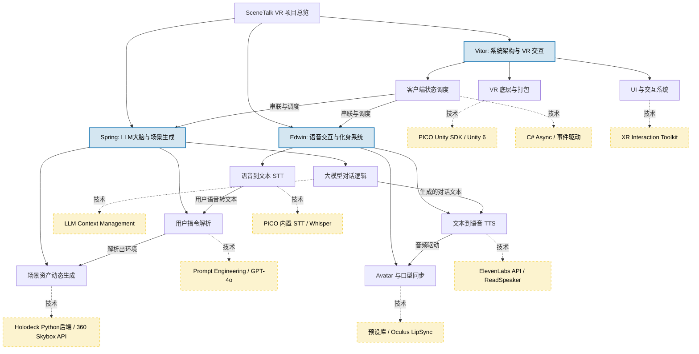

### 1. 项目已有基础与技术路线（资料中已提供的部分）
根据作业要求，你们的系统需要实现“用户指令 -> LLM解析 -> 场景与Avatar生成 -> 智能语音对话”的完整闭环。目前资料中已经为你们指明了以下基础：
*   **VR交互框架：** 基于PICO 4设备，使用PICO Unity Integration SDK及XR Interaction Toolkit进行开发。
*   **场景生成：** 推荐参考CVPR 2024的Holodeck项目，该项目通过自然语言（调用GPT-4o大模型）驱动生成3D Embodied AI环境。另外，要求中也给出了降级方案：生成一张360度场景图片以降低工程量。
*   **语音合成 (TTS)：** 提供了两种参考实现方式，一种是使用ReadSpeaker插件，另一种是集成发音逼真且带有情绪色彩的ElevenLabs API。
*   **大语言模型 (LLM) 接入：** 虽然具体代码未提供，但资料给出了在Unity中接入LLM的参考路线。

### 2. 缺失的部分与需要自行探索的技术（⚠️需要明确向老师展示你们有备而来）
参考资料并未覆盖全部技术栈，以下是**资料中没有，需要你们自己寻找技术方案**的内容（注：以下提到的具体工具名称如Whisper、Ready Player Me等为外部补充信息，供你们参考验证）：
*   **语音识别技术 (STT / ASR)：** 资料中只提供了让系统说话的TTS技术，但用户如何用英语与系统对话？你们需要自行寻找语音转文本（STT）的方案，例如接入OpenAI Whisper API、Azure Speech等。
*   **Avatar 生成与预设库：** 要求提到“Avatar的生成可以先考虑使用预设库”，但并没有给出具体的库。你们需要寻找如 Ready Player Me、Meta Avatars 或 Unity Asset Store 中的免费角色库。
*   **口型同步 (Lip Sync)：** 生成Avatar后，当它使用ElevenLabs播放语音时，嘴唇需要配合发音动作。这是一个增强沉浸感的关键点，需要自行寻找如 Oculus LipSync、Salsa 等Unity插件。
*   **360度全景图生成技术：** 如果你们选择工程量更小的“生成360场景图片”方案，资料中没有提供具体的生成工具，你们可能需要探索 Blockade Labs (Skybox AI) 或基于 Midjourney/Stable Diffusion 的全景图生成API。

### 3. 技术难点与风险评估（对应答辩重点）
在答辩时清晰地阐述这些难点并给出B计划，能拿到极高的“技术点阐述”分数：
*   **难点/风险1：开发环境与引擎版本冲突。** 
    *   **问题：** Holodeck项目明确要求使用 `Unity 2020.3.25f1` 并在 macOS或Ubuntu 下运行；而作业提示可以使用最新的 `Unity 6`；同时 PICO 4 SDK 也有其适配的Unity版本要求。
    *   **应对策略：** 早期需进行技术验证（Spike），确认各插件能否在同一Unity版本下兼容。如果Holodeck强依赖老版本，可能需要将其作为独立的后端服务，通过网络将生成的布局数据传给前端的PICO应用。
*   **难点/风险2：系统延迟（Latency）破坏沉浸感。** 
    *   **问题：** 用户的语音对话流程为：录音 -> STT转文本 -> LLM生成回复 -> TTS生成音频 -> 传回VR播放。这条长链路极易产生数秒的延迟。
    *   **应对策略：** 采用流式传输（Streaming）技术，LLM逐句输出，TTS逐句合成并播放，利用ElevenLabs等平台的流式API降低首字延迟。
*   **难点/风险3：动态3D场景生成的性能瓶颈。** 
    *   **问题：** Holodeck生成的3D环境（依赖AI2-THOR）在PC上运行良好，但在PICO 4这样的安卓一体机上动态加载庞大的3D资产可能会导致严重卡顿或内存溢出。
    *   **应对策略：** 优先采用**360度场景图片**作为背景天空盒方案，只在用户近处放置少量可交互的3D预设物体（如桌子、咖啡杯），确保VR帧率。

### 4. 项目分工与预期工作量安排建议（针对3人小组）
为了符合“分工合理明确”的评分指标，可以考虑按照**模块化**进行拆分。以下是为你们小组（Vitor、Spring、Edwin）提供的一个初步建议方案：

*   **Vitor（组长）- 系统架构与VR底层交互：** 
    *   负责PICO 4 SDK环境搭建与打包测试。
    *   整体流程调度：串联各个模块（用户录音 -> 状态机控制 -> 结果播放）。
    *   UI与场景搭建：VR内的基础UI交互操作（如开始对话、结束练习的按钮等）。
*   **Spring - LLM大脑与场景生成：** 
    *   设计Prompt解析用户的情境指令（提取任务、环境、人设）。
    *   负责对话逻辑大模型（如GPT-4o）的接入与上下文记忆管理。
    *   研究并实现场景生成方案（调用Holodeck生成空间布局，或接入外部全景图生成API）。
*   **Edwin - 语音交互与Avatar化身：** 
    *   对接用户的语音识别（STT）和系统语音合成（ElevenLabs/ReadSpeaker TTS）。
    *   寻找Avatar预设库并集成到Unity中。
    *   （进阶）实现根据角色设定的动态调节（如口音匹配、基础口型或身体动画）。

### 5. 开题答辩 PPT 核心结构建议（限时7分钟）
既然我们理清了情况，后续做PPT时建议分为以下几页：
1. **项目背景与目标（1分钟）：** 简述SceneTalk VR解决的痛点（传统VR口语缺乏动态情境生成）。
2. **系统整体技术路线（2分钟）：** 画一张流程图，展示从“自然语言指令 -> LLM解析 -> 场景/Avatar/语音生成”的完整管线。
3. **关键技术选型（1.5分钟）：** 明确展示你们选择的PICO环境、大模型、TTS/STT方案以及360图/Holodeck 3D场景方案的区别与取舍。
4. **技术难点与风险应对（1.5分钟）：** **高分项**，抛出前面提到的版本兼容、性能和延迟问题，并给出你们的B计划。
5. **分工与时间规划（1分钟）：** 展示组员职责，并给出一个按周（例如第14周原型、第15周功能联调、第16周打磨等）的时间表。

### 一、 核心缺失技术调研与最佳备选方案

#### 1. 语音识别技术 (STT / ASR)
*   **最佳方案 A（原生兼容）：使用 PICO SDK 内置的 Speech-to-text 服务。**
    根据官方文档，PICO Unity Integration SDK 的平台服务（Platform services）中自带了 `Speech-to-text` 功能，甚至提供了现成的 Demo 可供参考。**优势**是无需额外接入第三方 API，直接利用硬件底层生态，兼容性最强。
*   **备选方案 B（业界标杆）：接入 OpenAI Whisper API。**
    如果 PICO 原生 STT 对带口音的英语识别率不够，可以在 Unity 中通过录制麦克风音频，将其转为 Base64 或二进制文件发送给 OpenAI Whisper API。**优势**是识别准确率极高。

#### 2. Avatar 生成与预设库
*   **最佳方案 A：接入 Ready Player Me (RPM) 预设库（外部调研推荐）。**
    作业要求指出“Avatar的生成可以先考虑使用预设库”。RPM 是目前 Unity VR 游戏中最成熟的免费虚拟化身库。可以通过用户指令（如“服务员”、“海关人员”）让大模型返回特定的职业关键词，系统根据关键词在预设库中动态加载匹配的 Avatar 预制体（Prefab）。
*   **备选方案 B：Unity Asset Store 静态模型库。**
    提前在项目中内置 5-10 个代表不同场景（咖啡店、机场等）的高质量基础人物模型。虽然不够动态，但能保证打包在本地，避免网络加载失败。

#### 3. 口型同步技术 (Lip Sync)
*   **技术痛点：** ElevenLabs 虽然能生成非常真实、带情绪的声音，但它在 Unity 中通过脚本返回的是普通的 `AudioClip`。如果没有口型同步，Avatar 说话时像木偶，会严重破坏 VR 沉浸感。
*   **最佳方案 A：Oculus LipSync Unity 插件（外部调研推荐）。**
    这是一个免费且广泛使用的插件。它可以直接监听 ElevenLabs 播放的 `AudioClip` 的音轨，实时分析音频频谱，并驱动 Avatar 面部的 Blendshapes（混合形态）实现精准的口型同步。
*   **备选方案 B：基于音量 RMS 的下颌骨驱动（自行实现）。**
    如果面部形变绑定困难，可以写一个简单的脚本：根据当前播放音频的音量大小，动态调整模型下巴骨骼的上下旋转角度，实现“张嘴/闭嘴”的伪同步效果。

#### 4. 360度全景图生成技术
*   **最佳方案 A：Blockade Labs (Skybox AI) API（外部调研推荐）。**
    作业要求提到，为了降低工程量，虚拟场景可以考虑生成一张360场景图片。Skybox AI 是专门通过文字生成 360 度全景图的工具，返回的是等距柱状投影图。
*   **实现路径：** LLM 解析出环境指令后（如“咖啡店”），将其翻译成生成提示词发给 API，下载图片后，在 Unity 中动态替换 Skybox（天空盒）的材质。

---

### 二、 关键难点、风险评估与技术备案（答辩高分关键）

在答辩时，向老师展示你们不仅看到了美好的预期，还预判了潜在的“坑”，会极大提高分数。

#### 风险 1：开发环境与引擎版本冲突（致命风险）
*   **风险评估：** 资料显示，Holodeck 项目严格要求使用 `Unity 2020.3.25f1` 版本，并在 macOS 或 Ubuntu 下运行。然而，PICO 4 开发更推荐使用较新的 XR Interaction Toolkit 2.3+，且作业要求中也建议了可以尝试最新的 `Unity 6`。将陈旧的 Holodeck 底层与最新的 PICO SDK 强行塞进同一个工程极易引发包冲突或编译失败。
*   **技术备案 (B计划)：前后端解耦架构。**
    绝对不要在同一个 Unity 客户端工程里混用！将基于 Holodeck 的 3D 场景生成作为一个独立的 Python 后端服务运行。VR 客户端（使用 Unity 6 或最适配 PICO 的版本）只负责发送语言指令；后端 Holodeck 生成环境布局后，将其转化为 JSON 坐标数据发送给前端；前端 Unity 根据坐标实例化预制的 3D 资产。**如果此路依然太重，直接降级采用要求中推荐的“360场景图片”方案。**

#### 风险 2：长链路导致严重的系统延迟 (Latency)
*   **风险评估：** 整个交互链路为：`用户说话 -> 录音 -> PICO STT转文字 -> 调用大模型LLM生成对话 -> 传给ElevenLabs生成语音 -> 下载AudioClip -> 在Unity中播放`。这套串行请求很容易导致用户说完话后，需要干等 3-5 秒甚至更久 Avatar 才会回复，严重影响对话体验。
*   **技术备案 (B计划)：流式处理与“思考动作”掩盖。**
    首先，利用流式（Streaming）API：让大模型逐句输出，ElevenLabs 逐句合成音频并提前缓冲。其次，在代码逻辑上增加一层“交互润滑”：在等待音频生成的这几秒钟内，为 Avatar 播放“点头”、“摸下巴思索”的动作，或者播放预设的“Hmm, let me see...”等极短的语气词音频，用视觉和简短的听觉反馈掩盖网络延迟。

#### 风险 3：动态 3D 场景生成的性能瓶颈
*   **风险评估：** Holodeck 使用的 AI2-THOR 是一个非常庞大的 3D 具身智能资产库。如果在 PICO 4（基于安卓系统的移动端一体机）上动态加载、实例化大量未优化的 3D 物品，极容易产生严重掉帧甚至内存溢出导致闪退。
*   **技术备案 (B计划)：混合场景策略 (360全景 + 局部3D交互)。**
    将性能集中在刀刃上。远景和整体环境使用 **360度场景图片** 搭建（极低性能开销）；只在用户面前（1.5米范围内）动态生成少量必须可交互的 3D 物品（例如咖啡桌、水杯、菜单），并确保所有接入场景的预设库模型已经过严格的减面优化（Low Poly）。

### 总结：PPT 技术部分建议展现的亮点
在制作 PPT 时，你们可以将上述内容浓缩为一张**“系统架构与风险控制矩阵”**：
1.  **链路清晰：** 明确展示 PICO STT -> LLM -> 动态环境/Avatar -> ElevenLabs TTS -> Oculus LipSync 的数据流。
2.  **优雅降级：** 明确表示团队的策略是“保底全景图，冲刺 Holodeck 3D 生成”。
3.  **扬长避短：** 利用 PICO 原生 SDK 解决基础交互，将高风险的 AI 生成模块异步化、服务端化。

### 选项一：适合直接复制粘贴到 PPT 的分工排版

你可以在 PPT 中使用“三列式”布局或“卡片式”布局来展示这三位成员的分工，以下是每张卡片面的核心文本：

#### 🧑‍💻 Vitor (组长) —— 系统架构与 VR 底层交互 (System & VR Core)
*   **核心职责：** 负责客户端底层环境搭建、模块调度与最终工程打包，把控整体交互体验。
*   **负责模块：** 
    *   PICO 4 SDK 环境配置与设备联调。
    *   VR 基础交互系统（射线抓取、UI 菜单点击等）。
    *   客户端主状态机调度（串联录音、大模型、场景生成的时序逻辑）。
*   **涉及技术点：** Unity 引擎（建议 Unity 6）、PICO Unity Integration SDK、XR Interaction Toolkit (2.3+ 版本)、C# 异步编程、性能分析工具（Metrics HUD/Snapdragon Profiler）。
*   **难点攻坚：** 解决前后端数据通信问题，处理多模块集成的版本冲突。

#### 🧠 Spring (组员) —— LLM 大脑与场景生成 (AI Brain & Scene Gen)
*   **核心职责：** 负责将用户的自然语言指令转化为具象的虚拟环境，并赋予系统“对话大脑”。
*   **负责模块：**
    *   LLM 意图解析：从用户输入中提取“任务类型、环境类型、Avatar 人设”。
    *   场景生成后端服务：根据解析结果，动态生成 3D 空间布局或 360 度全景图。
    *   对话记忆与提示词工程（Prompt Engineering）。
*   **涉及技术点：** GPT-4o API、Holodeck 场景模块库 (AI2-THOR)、360 Skybox AI 生成接口、Python 后端服务搭建（如 FastAPI，用于解耦 Holodeck 与 Unity）。
*   **难点攻坚：** Holodeck 动态生成的性能优化，保底 360 全景图方案的平滑切换。

#### 🗣️ Edwin (组员) —— 语音交互与化身系统 (Voice & Avatar System)
*   **核心职责：** 负责“听、说、动”，打造具备沉浸感的虚拟对话对象。
*   **负责模块：**
    *   语音识别模块 (STT)：将用户的语音转化为文本指令。
    *   语音合成模块 (TTS)：让 Avatar 用逼真的音色和情绪说话。
    *   Avatar 加载与口型同步：根据人设加载预设库模型，并实现语音驱动面部动作。
*   **涉及技术点：** PICO 原生 Speech-to-text 服务（或 Whisper API）、ElevenLabs API / ReadSpeaker 插件、Ready Player Me (RPM) 预设库、Oculus LipSync (口型同步插件)。
*   **难点攻坚：** 使用流式 API 解决 TTS 生成和下载的长链路延迟，确保 Avatar 口型不穿帮。

---

### 选项二：Mermaid 架构图代码（可用于生成流程/结构图）

你可以将以下代码复制到支持 Mermaid 的工具中（如 Typora, Notion, 或在线的 Mermaid Live Editor），即可自动生成一张漂亮的结构图截取到 PPT 中：

**PPT 制作建议：**
在进行该页 PPT 答辩时，建议由 Vitor（组长）主讲。重点突出：**“我们的分工是高度模块化的，Vitor 负责客户端的容器底座，Spring 负责云端的大脑与环境生成，Edwin 负责对接真实用户的视听交互，三者通过定义好的接口进行通信，能最大程度避免代码冲突并加速开发进度。”** 这将极大满足评分指标中“分工合理、明确”的要求。
