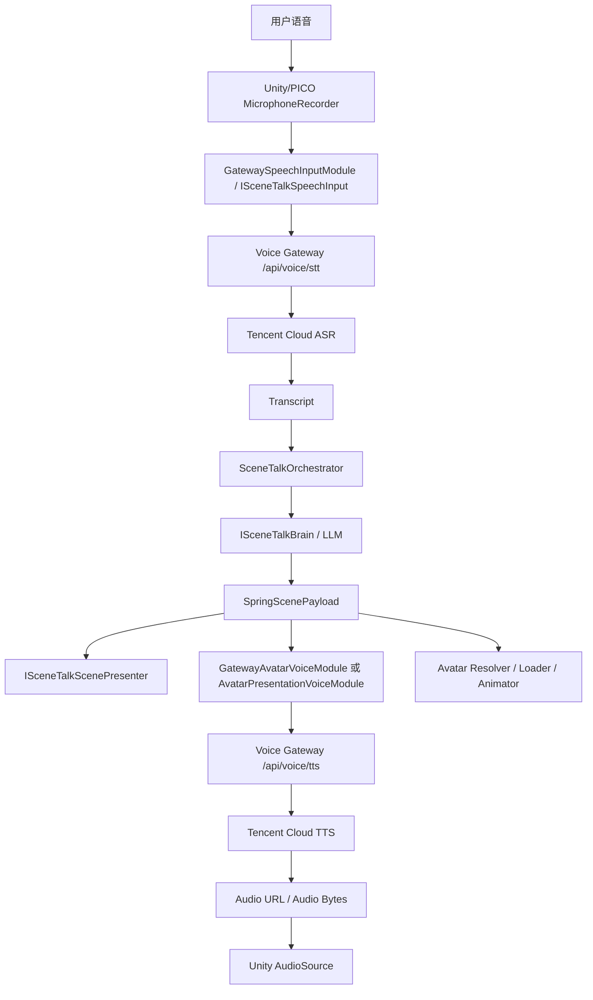

# SceneTalkVR STT/TTS 语音网关技术规划

## 1. 文档目标

本文档用于指导当前阶段如何在 SceneTalkVR 中实现“低成本、可替换、适合 PICO/VR 口语练习的 STT/TTS 语音链路”。这里的语音网关不是单纯把云厂商 API 包一层代理，而是指：

```text
Unity/PICO 麦克风采集 -> 后端语音网关 -> 云 STT -> LLM/对话编排 -> 云 TTS -> 音频返回 Unity 播放
```

当前阶段的核心目标是先选用 `腾讯云 ASR + 腾讯云 TTS` 跑通真实语音闭环，同时保持后端 provider 可替换，后续可以把腾讯云切换或并行对照为 Azure、OpenAI、百度、讯飞、Whisper、Coqui XTTS 等方案。

本文档只规划 Edwin 负责的语音输入、语音输出、语音网关和语音体验边界。LLM 生成、场景生成、VR 底层交互、PICO 打包和 Avatar 外观资产生产仍然沿用现有模块边界，不在语音模块中重新实现。

## 2. 当前项目基础

当前 Unity 客户端位于 `Client`，已有以下基础：

- `SceneTalkOrchestrator`：负责练习流程状态机，按顺序串联语音输入、LLM/场景生成、场景呈现和 Avatar 回复。
- `SceneTalkContracts`：定义模块接口与跨模块数据结构。
- `ISceneTalkSpeechInput`：语音输入接口，当前负责把用户语音转为 transcript。
- `ISceneTalkAvatarVoice`：Avatar/TTS 输出接口，当前负责读取 `SpringScenePayload.dialogueReply` 并播放回复。
- `DemoSpeechInputModule`：当前假 STT 模块，返回固定 transcript。
- `DemoAvatarVoiceModule` / `AvatarPresentationVoiceModule`：当前假 TTS/Avatar 播放模块，可播放 demo 音频并驱动 Avatar 呈现。
- `SpringScenePayload.avatarRole`：已经包含 `speakingSpeed`、`accent`、`attitude` 等字段，适合传给 TTS 侧做语速、口音和语气控制。

因此真实 STT/TTS 不应该绕开现有主流程单独实现，而应该作为 `SceneTalkOrchestrator` 的两个可替换 adapter 接入。

## 2.1 当前实现状态（2026-06-09）

P0 最小实现已经完成。当前完成范围是 Unity Editor + 后端语音网关 + 腾讯云 ASR/TTS 的 turn-based 真实闭环；PICO 真机验证、流式 STT/TTS、打断、缓存、日志脱敏和真实口型同步进入 P1/P2。

- 已有稳定的模块接口：`ISceneTalkSpeechInput.CaptureSpeech(...)` 和 `ISceneTalkAvatarVoice.PresentReply(...)`。
- 已有假数据闭环：点击 `Start` 后模拟 STT，点击 `Confirm` 后进入 LLM/场景/Avatar 回复流程。
- 已有 Avatar P0 呈现模块：`AvatarPresentationVoiceModule` 能根据 payload 解析并加载 Avatar，占位音频可播放。
- 已新增 `Server/voice-gateway` 后端语音网关，当前使用无依赖 Python 标准库 HTTP server，支持 `MockSpeechProvider` 与 `TencentSpeechProvider`。
- 网关已提供 `/health`、`/api/voice/stt`、`/api/voice/tts` 和 `/api/voice/audio/{requestId}.wav`，Unity adapter 已完成联调。
- Mock STT 返回固定英文 transcript；Mock TTS 返回占位 wav tone，用作离线兜底。
- 已新增 Unity 侧 `VoiceGatewayClient` 与 `GatewaySpeechInputModule`，可通过 HTTP 调用 `/api/voice/stt` 并把返回 transcript 交给 `SceneTalkOrchestrator`；后端 provider 可切换为 mock 或 tencent。
- 已新增 Unity 侧 `MicrophoneRecorder`，可录制默认麦克风音频，编码为 16-bit WAV base64 并随 STT 请求上传到语音网关。
- 已扩展 Unity 侧 `VoiceGatewayClient`，可调用 `/api/voice/tts` 并下载返回的 WAV 音频为 `AudioClip`；后端 provider 可切换为 mock 或 tencent。
- 已扩展 `AvatarPresentationVoiceModule`，可优先播放语音网关 TTS 音频，失败时回退 demo 音频或 fallback 等待。
- 已新增 `SceneTalkVR/Setup/Rebuild Demo Rig With Voice Gateway`，可在现有 demo rig 上只切换语音网关 STT adapter 和 TTS 播放；原 `Rebuild Demo Rig` 仍保持离线 demo 输入。
- 已新增 `VoiceGatewaySettings.asset`，用于集中配置语音网关地址；团队开发时可把地址改为运行网关那台电脑的局域网 IP。
- 已新增后端 `TencentSpeechProvider`，通过腾讯云 API 3.0 签名调用 ASR `SentenceRecognition` 和 TTS `TextToVoice`。
- 已支持 `VOICE_GATEWAY_PROVIDER=mock|tencent` 切换，腾讯云密钥只从后端环境变量读取。
- 已支持 `TENCENT_FALLBACK_TO_MOCK=true`，腾讯云调用失败时可回退到 Mock provider，保证 demo 可用。
- 已用真实腾讯云账号完成后端 live smoke test：TTS 返回真实 WAV，ASR 可识别英文语音。
- 已在 Unity Editor 中完成一次真实闭环：用户语音经腾讯云 STT 返回 transcript，Avatar 生成回复并通过腾讯云 TTS 播放音频。
- 已修正 P0 demo rig 的 `AvatarRoot` 默认位置、朝向和缩放，避免 Avatar 过近、背向镜头或遮挡字幕。
- 尚未实现流式播放、打断、缓存和日志脱敏。
- 尚未实现真实口型同步。P0 只要求音频播放和 speaking 动画触发稳定。

与 Vitor 多轮交互框架集成（2026-06-29）：

- 已合入 Vitor 的 `SceneTalkOrchestrator.IsDialogueActive` / `StartDialogueTurn()` 框架；初始确认生成场景后，用户可在同一场景中继续触发下一轮 `CaptureSpeech(...) -> GenerateSceneAndReply(...) -> PresentReply(...)`。
- Edwin 语音侧 adapter 仍按“每一轮一次 STT、每一轮一次 TTS”工作：`GatewaySpeechInputModule` 负责当前轮录音和 transcript，`AvatarPresentationVoiceModule` 负责当前轮 reply 的 TTS 和播放完成回调。
- 当前 Unity Brain 接口仍是 `GenerateSceneAndReply(string userText, ...)`；语音网关不保存 LLM 对话历史，也不决定上下文记忆。后续如果需要代词理解、连续纠错或长期任务状态，应由 Spring 的 LLM/Brain 层维护 history，并在必要时扩展 Brain 接口或 session 协议。
- 因此 Edwin 当前可表述为：语音与 Avatar 播放链路已可被连续回合框架重复调用，但 Edwin 不负责“LLM 记住前几轮说过什么”。

当前推荐下一步进入 P1：PICO 真机麦克风/播放验证、录音结束策略、实时转写体验和更细的错误恢复。

## 2.2 Edwin 分工边界

根据 `documents/conversation.md` 的三人分工，Edwin 的职责是“语音交互与化身系统”中的语音侧落地：让系统能听见用户、把用户语音转成文本、把 Avatar 回复合成为音频并稳定播放。结合当前仓库实际实现，本阶段把 Edwin 的工作边界收敛为：

Edwin 负责：

- STT/ASR：Unity 麦克风录音、音频格式转换、上传语音网关、接收 transcript。
- TTS：读取 `SpringScenePayload.dialogueReply` 和 `avatarRole` 里的语音画像，调用语音网关合成回复音频。
- 语音网关：维护 `Server/voice-gateway`、provider 抽象、腾讯云 ASR/TTS adapter、mock fallback、LAN 网关配置说明。
- Unity 语音 adapter：维护 `MicrophoneRecorder`、`VoiceGatewayClient`、`GatewaySpeechInputModule`，以及 `AvatarPresentationVoiceModule` 中和 TTS 播放相关的接入。
- 语音体验增强：录音结束策略、基础 VAD、TTS 播放状态、打断接口、STT/TTS 延迟统计、语音错误恢复和日志脱敏策略。
- Avatar 语音表现的接口层：提供 TTS 音频、speaking 状态和后续口型同步所需的音频播放入口。

Edwin 不负责：

- LLM 对话大脑、Prompt、对话上下文记忆和多轮回复策略。这部分属于 Spring 的 LLM 大脑与场景生成职责。
- 场景生成、Holodeck、360 Skybox、场景 prefab 绑定和 `coffee_table` / `menu` 等布局物体缺失问题。这部分属于场景生成/呈现链路。
- PICO SDK 环境搭建、XR Interaction Toolkit、VR UI、主状态机交互按钮和最终打包。这部分属于 Vitor 的系统架构与 VR 底层交互职责。
- Avatar 真实模型资产采购、外观 prefab 制作和角色预设库美术生产。Edwin 只负责语音驱动入口和后续口型同步对接，不负责模型本身。
- 云厂商账号归属和团队密钥发放流程。Edwin 文档中只说明安全接入方式：密钥留在后端网关主机，不进入 Unity 工程。

当前 P0 已完成的是 Edwin 语音侧最小闭环：用户说一段话，腾讯云 ASR 返回 transcript，现有 Brain 生成一次回复，腾讯云 TTS 返回音频，Unity 播放 Avatar 回复。合入 Vitor 的多轮交互框架后，这条语音链路可以在同一场景中被一轮一轮重复调用；但它仍不是带 LLM 对话记忆的完整多轮智能，对话历史、Prompt 和上下文策略仍属于 Spring 的 LLM/Brain 职责。

## 3. 总体设计原则

### 3.1 客户端不直连云厂商

Unity/PICO 客户端不应直接调用腾讯云、Azure、OpenAI、百度或讯飞 API。

原因：

- 云密钥不能放在 Unity 包、Android 包或 Web 客户端中。
- 后续如果切换供应商，不应重新修改和打包客户端。
- Web、PICO、Android、iOS、Windows 的鉴权和网络策略不同，直接接厂商 SDK 会增加维护成本。
- VAD、降噪、回声处理、缓存、日志脱敏和成本统计更适合集中在服务端治理。

客户端只负责：

- 麦克风采集。
- 音频分片或录音文件上传。
- 接收 transcript、状态和音频结果。
- 播放音频。
- 处理取消、重试和打断。

### 3.2 语音网关统一 provider

后端语音网关对 Unity 暴露统一协议，对云厂商暴露 adapter。

推荐边界：

```text
Unity Client
  -> Voice Gateway API / STT
    -> STT Provider Adapter
  -> SceneTalkOrchestrator
    -> Brain / LLM Service
  -> Voice Gateway API / TTS
    -> TTS Provider Adapter
  -> Unity Audio Playback
```

第一阶段 provider 默认使用腾讯云：

- STT：腾讯云实时语音识别 ASR。
- TTS：腾讯云在线语音合成 TTS。

后续语音 provider 可以替换为：

- Azure Speech STT/TTS。
- OpenAI Whisper / GPT audio。
- 百度智能云语音。
- 讯飞语音听写 / 语音合成。
- 自托管 Whisper + Coqui XTTS。

### 3.3 成本和质量平衡

当前项目 PoC 首选腾讯云 ASR + 腾讯云 TTS，理由：

- 中国大陆网络路径和账号采购更顺手。
- ASR/TTS 单次成本低，适合频繁课堂演示和调试。
- TTS 可先用精品音色，后续再测试大模型音色或音色复刻。
- 后端网关保留 provider 抽象后，未来仍可切到 Azure 等英文口语能力更强的方案。

### 3.4 流式优先，但 P0 不强行全流式

VR 对话体验最终需要低延迟。理想链路应支持：

```text
用户说话 partial -> LLM 开始生成 -> TTS 分段合成 -> Unity 边收边播
```

但 P0 阶段不建议一开始就把 STT、LLM、TTS 全部做成复杂流式链路。推荐先实现稳定的 turn-based 闭环：

```text
录一段话 -> 上传 -> 返回 transcript -> LLM 返回 reply -> TTS 返回音频 -> Unity 播放
```

P0 成功后再逐步引入实时 STT partial、TTS 分段播放和 barge-in 打断。

### 3.5 可降级

语音模块必须允许网络失败、供应商失败、TTS 失败和音频播放失败。任何失败都不应该让 Unity 主流程崩溃。

推荐降级顺序：

```text
腾讯云实时服务 -> 腾讯云普通/短音频接口 -> 预设 transcript / 预设音频 -> Demo 假模块
```

在课堂展示和答辩场景中，应保留离线 demo 数据作为兜底。

## 4. 阶段目标

### 4.1 P0：Edwin 语音侧真实 turn-based 闭环

目标：不做复杂流式，先让 Unity/PICO 能通过后端网关完成真实语音输入和真实 TTS 回复。

需要完成：

- 新建后端 `voice-gateway` 服务。
- Unity 新增 `GatewaySpeechInputModule`，替换 `DemoSpeechInputModule`。
- Unity 新增或扩展 `GatewayAvatarVoiceModule` / `AvatarPresentationVoiceModule`，替换 demo 音频播放。
- Unity 侧录制用户语音，转成后端可接受的音频格式。
- 后端调用腾讯云 ASR，返回 transcript。
- 后端接收 `dialogueReply` 与 `avatarRole`，调用腾讯云 TTS，返回音频 URL 或音频字节。
- Unity 下载或接收音频，转成 `AudioClip` 后播放。
- 记录每次请求的基础耗时、供应商和降级原因。

P0 阶段的音频可以先使用整段上传和整段播放。重点不是最低延迟，而是架构边界、鉴权安全和真实可用性。

当前状态：P0 已完成。验证范围是 Unity Editor + 后端语音网关 + 腾讯云 ASR/TTS。Vitor 的连续回合框架已合入并可重复调用 Edwin 的 STT/TTS adapter，但 PICO 真机验证、LLM 对话记忆和自动打断不计入 P0 完成条件。

### 4.2 P1：Edwin 语音体验增强

目标：降低用户说完话后的等待时间，让语音模块在 Vitor 的连续回合框架中具备更稳定的录音、播放和错误恢复能力。P1 不实现 LLM 对话记忆，只向上游 Brain/Orchestrator 提供每一轮可靠的语音输入输出和播放完成信号。

需要完成：

- Unity 侧支持手动结束录音和基础静音检测，避免固定录音时长。
- PICO 4 上验证麦克风权限、采样率、录音设备、上传、识别和播放稳定性；PICO SDK 与打包环境由 Vitor 负责。
- 后端增加结构化语音日志：provider、STT/TTS 耗时、错误码、fallbackLevel、TTS 字符数、音频时长。
- 补齐日志脱敏策略，默认不保存原始音频和完整 transcript。
- 明确云服务失败、超时、空 transcript、音频下载失败时的 fallback 和用户提示。
- 给 Orchestrator 提供“Avatar TTS 播放结束 / 可开始下一轮录音”的清晰完成回调，方便后续连续对话集成。
- 评估腾讯云实时 ASR WebSocket 是否进入 P1，若时间紧则先保留整段上传，只完成手动结束/VAD 和 PICO 验证。

P1 阶段仍可保持 TTS 整段合成播放，先把录音结束、真机可用性和错误恢复做好。

### 4.3 P2：TTS 分段合成、缓存与打断

目标：Avatar 回复不要等整段长文本全部合成完才开始说话。

需要完成：

- 接收 Brain/LLM 提供的句子或语义片段。
- 后端按片段调用腾讯云 TTS。
- Unity 端按片段排队播放。
- 支持同一句文本的 TTS 缓存，减少重复场景的成本和等待。
- 用户重新说话或点击退出时，中断正在播放的 TTS。
- 记录 TTS 首包时间、音频下载时间、播放队列长度和缓存命中率。

P2 仍属于 Edwin 语音侧，但“LLM 如何分句输出、如何维护对话历史、何时结束练习”由 Spring/Vitor 的 Brain 与 Orchestrator 决定。Edwin 只消费文本片段并负责合成、播放、缓存和打断。

### 4.4 P3：供应商 A/B、口语评测与高级语音表现

目标：在稳定腾讯云主链路基础上，评估更适合英语学习的语音能力。

可选方向：

- 并行接入 Azure Speech，测试英语学习者口音鲁棒性和发音评估能力。
- 并行接入 Whisper，评估英文识别准确率和隐私路线。
- 接入腾讯云大模型音色或音色复刻，提高 Avatar 角色一致性。
- 接入口型同步模块，让 TTS 音频驱动 Avatar mouth shapes。
- 针对不同场景包配置热词，例如咖啡店、机场、酒店、面试。

P3 不应影响 P0-P2 的稳定链路。供应商切换失败时直接回退腾讯云默认 provider。

## 5. 推荐目录结构

建议在仓库中增加后端语音网关目录：

```text
Server/
  voice-gateway/
    src/
      api/
        speechRoutes.*
      providers/
        SpeechProvider.*
        TencentSpeechProvider.*
        AzureSpeechProvider.*
        MockSpeechProvider.*
      sessions/
        VoiceSessionStore.*
      audio/
        AudioNormalizer.*
        AudioCache.*
      logging/
        VoiceTelemetry.*
    config/
      providers.example.*
    README.md
```

Unity 客户端建议在 `Client/Assets/SceneTalkVR` 下增加：

```text
Client/Assets/SceneTalkVR/
  Voice/
    Scripts/
      GatewaySpeechInputModule.cs
      GatewayAvatarVoiceModule.cs
      VoiceGatewayClient.cs
      MicrophoneRecorder.cs
      AudioClipDecoder.cs
    Docs/
      VoiceGatewayClientSetup.md
```

如果后续继续沿用 `AvatarPresentationVoiceModule` 作为组合模块，也可以只新增：

```text
Client/Assets/SceneTalkVR/Voice/Scripts/
  GatewaySpeechInputModule.cs
  GatewayTtsClient.cs
  VoiceGatewayClient.cs
  MicrophoneRecorder.cs
  AudioClipDecoder.cs
```

然后由 `AvatarPresentationVoiceModule` 调用 `GatewayTtsClient` 播放真实音频。

## 6. 数据协议设计

### 6.1 STT 请求

P0 阶段可以先使用整段音频上传：

```http
POST /api/voice/stt
Content-Type: multipart/form-data

sessionId=scenetalk-demo-001
sampleRate=16000
channels=1
format=wav
language=en-US
sceneType=ordering_coffee
audio=<binary>
```

响应：

```json
{
  "requestId": "stt_20260608_001",
  "provider": "tencent",
  "isFinal": true,
  "transcript": "I want to practice ordering coffee with a fast-speaking foreign barista.",
  "confidence": 0.91,
  "durationMs": 3280,
  "latencyMs": 740,
  "fallbackLevel": "none"
}
```

P1 阶段可升级为 WebSocket：

```text
Unity -> Gateway: audio.chunk
Gateway -> Unity: stt.partial
Gateway -> Unity: stt.final
Gateway -> Unity: stt.error
```

### 6.2 LLM/Brain 输入

当前 `ISceneTalkBrain.GenerateSceneAndReply(string userText, ...)` 已能消费 transcript。P0 阶段不需要修改接口。

如果后端语音网关未来同时编排 LLM，则可以把 transcript、场景上下文和会话状态组合成一个服务端请求：

```json
{
  "sessionId": "scenetalk-demo-001",
  "turnId": "turn_003",
  "transcript": "I want to practice ordering coffee.",
  "language": "en-US",
  "sceneType": "ordering_coffee",
  "avatarRoleHint": "barista"
}
```

当前不建议在 P0 把 LLM 强行塞进语音网关。更稳的做法是：

```text
Unity STT adapter -> SceneTalkOrchestrator -> Brain adapter -> Avatar/TTS adapter
```

后端语音网关先只负责 STT 和 TTS，避免一次性改动主流程。

### 6.3 TTS 请求

P0 阶段 TTS 请求由 Unity 的 Avatar/TTS 模块发给网关：

```http
POST /api/voice/tts
Content-Type: application/json
```

```json
{
  "sessionId": "scenetalk-demo-001",
  "turnId": "turn_003",
  "text": "Good morning! What can I get for you today?",
  "language": "en-US",
  "voiceProfile": {
    "provider": "tencent",
    "voiceId": "default_female_en",
    "speakingSpeed": "fast",
    "accent": "american",
    "attitude": "friendly",
    "role": "barista"
  },
  "output": {
    "format": "wav",
    "sampleRate": 24000
  }
}
```

`voiceId` 不再长期写死为女声。P1 性别支持中，Unity 侧 `AvatarPresentationVoiceModule` 会优先根据当前 resolved Avatar preset 的 `genderPresentations`，其次根据 payload 的 `avatarRole.appearance.genderPresentation`，传入 `default_male_en` / `default_female_en`；网关只负责把该 alias 映射到具体腾讯云 voice type。

响应可以二选一：

```json
{
  "requestId": "tts_20260608_001",
  "provider": "tencent",
  "audioUrl": "https://gateway.local/audio/tts_20260608_001.wav",
  "format": "wav",
  "sampleRate": 24000,
  "textCharacters": 45,
  "latencyMs": 510,
  "cacheHit": false,
  "fallbackLevel": "none"
}
```

或直接返回二进制音频：

```http
HTTP 200
Content-Type: audio/wav
```

P0 推荐先用 `audioUrl` 或二进制整段返回。P2 再升级为音频流或分段队列。

### 6.4 统一错误响应

所有接口失败都返回统一结构：

```json
{
  "requestId": "stt_20260608_001",
  "provider": "tencent",
  "errorCode": "provider_timeout",
  "message": "Tencent ASR timed out after 5000 ms.",
  "fallbackLevel": "mock_transcript",
  "retryable": true
}
```

Unity 侧只显示适合用户看的短错误，详细错误只写入本地 debug log 或服务端日志。

## 7. 代码设计

### 7.1 Unity 端模块

建议新增：

- `GatewaySpeechInputModule`
- `GatewayAvatarVoiceModule`
- `VoiceGatewayClient`
- `MicrophoneRecorder`
- `AudioClipDecoder`

`GatewaySpeechInputModule` 实现现有接口：

```csharp
public sealed class GatewaySpeechInputModule : MonoBehaviour, ISceneTalkSpeechInput
{
    public IEnumerator CaptureSpeech(
        Action<string> onComplete,
        Action<string> onError);
}
```

职责：

- 启动麦克风录音。
- 控制最大录音时长和静音结束。
- 将音频转换为网关要求的格式。
- 调用 `/api/voice/stt`。
- 成功后调用 `onComplete(transcript)`。
- 失败后调用 `onError(message)`。

`GatewayAvatarVoiceModule` 可以实现：

```csharp
public sealed class GatewayAvatarVoiceModule : MonoBehaviour, ISceneTalkAvatarVoice
{
    public IEnumerator PresentReply(
        SpringScenePayload payload,
        Action onComplete,
        Action<string> onError);
}
```

职责：

- 读取 `payload.dialogueReply`。
- 读取 `payload.avatarRole.speakingSpeed`、`accent`、`attitude`、`role`。
- 调用 `/api/voice/tts`。
- 下载或接收音频。
- 设置 `AudioSource.clip` 并播放。
- 播放期间触发 speaking 动画。
- 播放结束后调用 `onComplete()`。

如果继续使用 `AvatarPresentationVoiceModule` 组合 Avatar 呈现和语音播放，则真实 TTS 可以作为其内部依赖，不必立刻新增独立 voice module。

### 7.2 后端 provider 接口

后端应把云厂商细节收敛到 provider interface。

推荐接口：

```text
SpeechProvider
  transcribe(audio, options) -> SttResult
  synthesize(text, voiceOptions) -> TtsResult
```

腾讯云实现：

```text
TencentSpeechProvider
  - 负责腾讯云签名和鉴权。
  - 负责 ASR 请求参数映射。
  - 负责 TTS 音色、语速、采样率和格式映射。
  - 负责把腾讯云错误码转换成统一错误码。
```

Mock 实现：

```text
MockSpeechProvider
  - 本地返回固定 transcript。
  - 本地返回预设 wav 文件。
  - 用于离线演示和服务降级。
```

后续替换供应商时，只新增 provider，不改 Unity 客户端协议。

### 7.3 会话与日志

语音网关至少记录：

- `sessionId`
- `turnId`
- provider 名称
- STT 音频时长
- TTS 字符数
- 请求耗时
- 错误码
- fallbackLevel
- cacheHit

日志中不要保留完整原始音频和完整用户文本，除非明确用于调试并有本地开关。默认建议只保留脱敏摘要、长度和性能指标。

### 7.4 音频格式

P0 推荐：

- STT 输入：`16 kHz`、`16-bit`、`mono`、`wav` 或 PCM。
- TTS 输出：`24 kHz` 或 `16 kHz`、`wav`，先保证 Unity 解码稳定。

P1/P2 推荐：

- STT 分片：`20-60 ms` 一帧，优先 PCM，网络压力大时再评估 Opus。
- TTS 返回：短句 wav/mp3 分段，Unity 队列播放。

PICO 端要重点验证麦克风权限、采样率、录音设备名称和回声影响。

## 8. 架构示意



## 9. Edwin 当前阶段任务清单

### 9.1 Edwin 语音架构设计任务

- [x] 确定不让 Unity/PICO 客户端直连云厂商 API。
- [x] 确定后端语音网关作为 STT/TTS 统一入口。
- [x] 确定首选 provider 为腾讯云 ASR + 腾讯云 TTS。
- [x] 确定保留 provider 抽象，后续可替换 Azure/OpenAI/百度/讯飞/自托管。
- [x] 确定 P0 先做 turn-based 闭环，不强行全链路流式。

### 9.2 后端任务

- [x] 新建 `Server/voice-gateway` 服务。
- [x] 实现 `/api/voice/stt`。
- [x] 实现 `/api/voice/tts`。
- [x] 实现 `/api/voice/audio/{requestId}.wav` mock 音频下载。
- [x] 实现 `SpeechProvider` 抽象接口。
- [x] 实现 `TencentSpeechProvider`。
- [x] 实现 `MockSpeechProvider` 作为离线兜底。
- [x] 增加 provider 环境变量读取。
- [x] 增加基础请求耗时和 provider 日志。
- [ ] 增加字符数、音频时长和错误码的结构化日志。
- [ ] 增加文本和音频日志脱敏策略。

### 9.3 Unity 任务

- [x] 新增 `MicrophoneRecorder`。
- [x] 新增 `VoiceGatewayClient`。
- [x] 新增 `GatewaySpeechInputModule` 并实现 `ISceneTalkSpeechInput`。
- [x] 扩展 `AvatarPresentationVoiceModule`，支持从语音网关下载并播放 TTS 音频。
- [ ] 支持手动/静音结束。
- [x] 支持从网关下载音频并转换为 `AudioClip`。
- [x] 支持 TTS 播放时触发 speaking 动画。
- [x] 支持失败时回退 demo transcript 或 demo audio。
- [x] 更新 setup menu，新增 `SceneTalkVR/Setup/Rebuild Demo Rig With Voice Gateway` 入口，只挂载/切换语音网关 STT/TTS 模块，不重建场景生成配置。
- [x] 新增 `VoiceGatewaySettings.asset`，集中配置 `gatewayBaseUrl`。
- [x] 与 Vitor 多轮交互框架合并后，确认 `GatewaySpeechInputModule` 和 `AvatarPresentationVoiceModule` 可以按回合被重复调用。

### 9.4 验证任务

- [x] 后端完成一次腾讯云 live smoke test：ASR 识别英文语音，TTS 返回真实 WAV。
- [x] Unity Editor 中完成一次真实 STT：用户说话后显示腾讯云 transcript。
- [x] Unity Editor 中完成一次真实 TTS：Avatar 回复能播放腾讯云音频。
- [ ] PICO 4 真机验证麦克风权限、录音和播放。
- [ ] 验证云服务超时时进入可恢复错误或 demo fallback。
- [ ] 验证云密钥只存在后端，不进入 Unity 工程、Android 包或日志。
- [x] 记录 STT 延迟和 TTS 延迟。
- [ ] 记录单次练习估算成本。

### 9.5 明确不属于 Edwin 当前语音任务

- [ ] Spring：实现 LLM 多轮对话记忆、Prompt、上下文管理和回复策略。
- [ ] Spring：实现场景生成、Holodeck/360 Skybox 接入和场景布局数据生产。
- [x] Vitor：提供同一场景中连续触发下一轮的 Orchestrator/UI 框架。
- [ ] Vitor：实现 PICO SDK 环境、XR 交互、最终打包和主状态机真机交互体验。
- [ ] 场景/呈现链路：补齐 `coffee_table`、`menu` 等 prefab binding。
- [ ] Avatar 资产链路：采购或制作真实 humanoid 模型、角色 prefab 和美术预设库。

以上条目可以由 Edwin 的语音模块提供接口或测试数据配合，但不计入 Edwin 语音 P0/P1 的完成范围。

## 10. 验收标准

P0 最小实现完成时，应满足：

- Unity/PICO 客户端不包含腾讯云 SecretId、SecretKey 或长期访问 token。
- `GatewaySpeechInputModule` 可替换当前 `DemoSpeechInputModule`。
- `GatewayAvatarVoiceModule` 或 `AvatarPresentationVoiceModule` 可播放真实 TTS 音频。
- 一次完整流程能走通：录音 -> STT -> Confirm -> LLM/场景 -> TTS -> Avatar 播放。
- 云服务失败时不会导致 Unity 主流程崩溃。
- 后端或 Unity 日志能看到 provider 和 STT/TTS 耗时。
- 保留 Mock provider 或 demo 模块作为离线展示兜底。

当前状态：以上 P0 最小实现验收项已满足。PICO 真机、结构化日志、日志脱敏、音频时长/字符数统计和成本记录不阻塞 P0，移入后续阶段。

Edwin 语音 P1 阶段完成时，应满足：

- Unity 语音模块支持手动结束录音或基础静音结束。
- PICO 4 上录音、上传、识别和音频播放稳定；PICO 工程环境由 Vitor 提供。
- 用户说完后 STT final transcript 延迟可被量化。
- 语音网关具备结构化 provider、耗时、错误码、fallback 和成本相关日志。
- 云服务失败、空 transcript 和 TTS 下载失败都能进入可恢复 fallback。
- Avatar TTS 播放结束后，语音模块能给 Orchestrator 明确完成信号，确保 Vitor 的连续回合框架能在下一次用户触发时安全进入录音。

Edwin 语音 P2 阶段完成时，应满足：

- 长回复可以分段合成和播放。
- 相同 TTS 文本可以缓存复用。
- 用户退出或重新开始时可以打断正在播放的音频。
- Avatar speaking 动画和音频播放状态保持一致。

## 11. 风险与控制

### 11.1 云密钥泄漏

如果 Unity 客户端直接接腾讯云 API，密钥可能被反编译或从网络请求中暴露。

控制方式：

- 所有云密钥只放在后端环境变量或密钥管理服务。
- Unity 只访问语音网关。
- 网关给客户端返回短期 session 或只接受服务端信任来源。

### 11.2 延迟过长

串行链路可能变成：

```text
录音等待 -> ASR -> LLM -> TTS -> 下载音频
```

如果每段都等待完整结果，VR 对话会显得卡顿。

控制方式：

- P0 先保证可用，同时记录每段耗时。
- P1 引入实时 ASR partial。
- P2 引入 TTS 分段合成和缓存。
- 对 Avatar 增加 thinking 动画或短反馈音，减少等待感。

### 11.3 英语学习者口音识别不稳定

腾讯云在国内接入和成本上有优势，但项目核心是英语口语练习，需要验证中国学习者英语、停顿、重复和自我修正。

控制方式：

- 建立业务测试音频集，不只用标准英语 demo。
- 至少覆盖安静、轻噪、回声、中文母语者英语四类样本。
- P3 并行测试 Azure 或 Whisper，保留 provider 切换能力。

### 11.4 TTS 角色表现力不足

普通精品音色成本低，但未必满足所有 Avatar 的态度、口音和角色一致性。

控制方式：

- P0 先用低成本精品音色。
- P1 已补最小性别声线选择：resolved Avatar 或 `avatarRole.appearance.genderPresentation=male` 时使用 `default_male_en`，`female` 时使用 `default_female_en`，缺失或 `unknown` 时继续使用 Unity 侧默认值。
- 对 `speakingSpeed`、`accent`、`attitude` 做服务端映射表。
- P2/P3 再做角色 voice profile catalog，例如按 `role + gender + accent` 映射更细的腾讯云音色、腾讯云大模型音色、音色复刻或 Azure custom voice。

### 11.5 PICO 麦克风和回声问题

VR 设备中 Avatar 播放的声音可能被麦克风再次采集，影响下一轮 STT。

控制方式：

- TTS 播放期间默认暂停录音。
- P1 后加入 VAD 和基本回声控制策略。
- 必要时使用耳机、降低播放音量或限制自动监听时机。

### 11.6 日志隐私

用户语音和文本可能包含个人信息或课堂敏感内容。

控制方式：

- 默认不长期保存原始音频。
- transcript 日志只保留摘要、长度和错误定位所需片段。
- 调试日志开关必须显式开启，并在演示后清理。

## 12. 后续扩展方向

当 P0/P1 稳定后，可以逐步加入：

- 腾讯云实时 ASR WebSocket。
- TTS 分句合成和播放队列。
- 音频缓存和 CDN。
- 多供应商 A/B 测试。
- Azure 发音评估。
- Whisper 自托管离线/隐私路线。
- VAD、降噪、回声抑制。
- 口型同步。
- 角色 voice profile catalog。
- Avatar 性别驱动 voiceId 选择已接入，先复用 `default_male_en` / `default_female_en`，后续再扩展为角色级音色表。
- 单会话成本统计面板。

这些扩展必须保持在语音网关 provider 边界内，不应反向污染 `SceneTalkOrchestrator`。

## 13. 推荐下一步

P0 最小真实链路已经完成。建议下一步进入 Edwin 语音 P1 验证和体验增强：

1. 在 PICO 4 上验证麦克风权限、录音质量、上传、识别和播放稳定性。
2. 增加手动结束录音、静音结束或基础 VAD，避免固定录音时长影响交互。
3. 增加结构化日志：字符数、音频时长、错误码、单次练习估算成本。
4. 明确云服务失败时的 UI 提示和 demo fallback 行为。
5. 做一轮男女角色 TTS smoke test，确认男角色请求落到 `default_male_en`，女角色请求落到 `default_female_en`。
6. 继续强化 Avatar TTS 播放完成信号和录音禁用时机，确保 Vitor 的连续回合框架不会在 Avatar 还没说完时误触发下一轮。
7. 再评估是否接入腾讯云实时 ASR WebSocket、TTS 分段播放和 barge-in 打断。

如果时间紧，优先保证：

```text
真实 STT transcript + 性别匹配的真实 TTS 音频播放 + 云密钥不进 Unity + Demo fallback 可用
```

流式、打断、缓存、发音评估和口型同步可以排到 P1/P2/P3。

## 14. Codex 记忆与新会话交接

新 Codex 会话应先读取：

- `documents/conversation.md`：确认三人分工，尤其是 Edwin 只负责语音交互与 Avatar 语音表现接口，不负责 Spring 的 LLM/场景生成或 Vitor 的 VR 底层。
- `documents/speech-gateway-technical-plan.md`：确认当前 P0/P1 状态和 Edwin 语音边界。
- `Server/voice-gateway/README.md`：确认后端启动方式、腾讯云环境变量和 LAN 网关使用方式。
- `Client/Assets/SceneTalkVR/Voice/Docs/VoiceGatewayClientSetup.md`：确认 Unity 端 `gatewayBaseUrl`、网关客户端和 demo rig 接入方式。

当前可写入 Codex 记忆的项目事实：

- SceneTalkVR 的 Edwin 语音 P0 已完成：Unity Editor 中通过 voice-gateway + 腾讯云 ASR/TTS 跑通“用户说一句 -> transcript -> Avatar TTS 回复一句”的真实 turn-based 闭环。
- 当前已合入 Vitor 的连续回合框架：同一场景中可以一轮一轮触发 STT -> Brain -> TTS -> Avatar 回复；但还不是带 LLM 对话历史的完整多轮智能。
- Edwin P1 只聚焦语音侧：PICO 录音/播放验证、手动结束或基础 VAD、结构化语音日志、错误恢复、fallback、语音轮次完成信号。
- 不要把 `coffee_table` / `menu` prefab binding、场景生成、LLM 上下文记忆、PICO SDK 环境和最终打包算作 Edwin 语音任务。

建议给新会话的 P1 提示词见本文档外的交接消息；若新会话只读取文档，也可直接使用下面这段：

```text
你在 /Users/edwin/Documents/PROJECTS/Unity/SceneTalkVR 继续 SceneTalkVR 的 Edwin 语音模块 P1。先阅读 documents/conversation.md 和 documents/speech-gateway-technical-plan.md，严格按 Edwin 分工边界工作：只做 STT/TTS/voice-gateway/Unity 语音 adapter/语音体验增强，不做 Spring 的 LLM 对话记忆与场景生成，不做 Vitor 的 PICO SDK/VR UI/打包，不处理 coffee_table/menu prefab binding。

当前 P0 已完成：Unity Editor 已通过 Server/voice-gateway + 腾讯云 ASR/TTS 跑通真实 turn-based 闭环，用户说一句话后返回 transcript，现有 Brain 生成一次回复，Avatar 通过腾讯云 TTS 播放一句回复。Vitor 的连续回合框架已合入，可在同一场景中重复调用这条语音链路；但 LLM 对话历史仍未实现。

P1 目标：实现并验证 Edwin 语音侧体验增强，包括手动结束录音或基础静音/VAD、PICO 4 录音/上传/STT/TTS 播放验证、结构化 provider/latency/error/fallback 日志、失败 fallback、语音轮次完成信号。保持旧 demo path 可用，不泄露腾讯云密钥，不扩大改动范围。每一步完成后同步更新 documents/speech-gateway-technical-plan.md。
```
